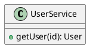
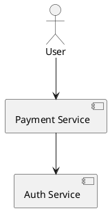
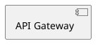
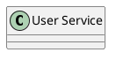
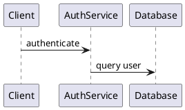
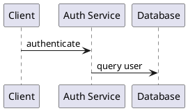
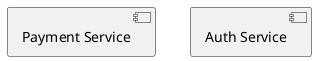
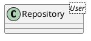
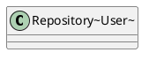
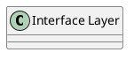

# Rendering Safety

PlantUML source goes through `plantuml-encoder` → HTTP fetch to the PlantUML server → SVG string → canvas render. A syntax error at any stage means a blank canvas and a dead conversation. The canvas then selects `svg g[id]` elements to make them clickable for annotations — elements without IDs are invisible to the feedback loop.

These 18 rules are ordered by blast radius: server errors first, then annotation-breaking issues, then layout problems.

---

## 1. Always wrap in @startuml / @enduml

The PlantUML server returns HTTP 400 for source missing the boundary markers. The `diagram_upsert` tool sends `puml_source` directly — there is no auto-wrapping.

**Incorrect (missing boundary):**

```plantuml
class UserService {
  +getUser(id): User
}
```

**Correct (explicit boundaries):**



## 2. Every element gets an explicit `as Alias`

The canvas makes SVG elements clickable by selecting `svg g[id]`. PlantUML only emits an `id` attribute on the `<g>` group when the element has an explicit `as` alias. Without it, the human cannot annotate the element — cutting off the primary feedback channel.

**Incorrect (no alias — element not clickable):**



**Correct (every element aliased — all clickable):**


## 3. Aliases must be single-word identifiers

SVG `id` attributes cannot contain spaces. PlantUML silently truncates or mangles multi-word aliases, breaking the canvas `g[id]` selector match. Use PascalCase for compound names.

**Incorrect (spaces in alias):**

```plantuml
@startuml
[API Gateway] as API Gateway
@enduml
```

**Correct (PascalCase alias):**



## 4. Quote display names, not aliases

Multi-word display labels need quotes. The alias (after `as`) must remain an unquoted identifier. Quoting the alias makes it a display-name override, not an SVG id.

**Incorrect (alias quoted — SVG id becomes the literal with quotes):**

```plantuml
@startuml
class "User Service" as "UserService"
@enduml
```

**Correct (quotes on label only):**



## 5. Declare sequence participants before use

Undeclared participants get auto-created by PlantUML when first referenced in a message. Auto-created participants often lack proper `id` attributes in the SVG, making them un-annotatable. Declaring them upfront also controls left-to-right order.

**Incorrect (participants declared implicitly):**



**Correct (explicit declaration with aliases):**



## 6. Set backgroundColor transparent

The canvas background is `#f4f1ec` with a dot grid. PlantUML's default white background creates a visible white rectangle that clashes with the warm canvas. Setting transparent lets the diagram float on the canvas naturally.

**Incorrect (default white background):**

```plantuml
@startuml
class UserService as UserService
@enduml
```

**Correct (transparent background):**

```plantuml
@startuml
skinparam backgroundColor transparent
class UserService as UserService
@enduml
```

## 7. Use canvas-matched colors for element styling

The canvas CSS palette is warm and muted. PlantUML defaults (bright blue headers, primary-color arrows) create jarring contrast on `#f4f1ec`. Match element colors to the canvas variables — see [_presets.md](_presets.md) for copy-paste blocks per diagram type.

**Incorrect (PlantUML defaults — bright blue on warm canvas):**

```plantuml
@startuml
skinparam backgroundColor transparent
class UserService as UserService {
  +getUser()
}
@enduml
```

**Correct (canvas-matched palette):**

```plantuml
@startuml
skinparam backgroundColor transparent
skinparam classBackgroundColor #ffffff
skinparam classBorderColor #78716c
skinparam classFontColor #1c1917
skinparam classHeaderBackgroundColor #eae6df
skinparam classArrowColor #78716c
class UserService as UserService {
  +getUser()
}
@enduml
```

See [_presets.md](_presets.md) for complete preset blocks per diagram type — do not hand-roll skinparams.

## 8. Component bracket syntax preserves SVG IDs

For component diagrams, the bracket syntax `[Name] as Alias` produces more reliable SVG `id` attributes than the long-form `component "Name" as Alias`. The bracket form is also more concise.

**Incorrect (long-form — inconsistent SVG IDs across PlantUML versions):**



**Correct (bracket syntax — reliable IDs):**


## 9. Escape angle brackets with tilde syntax

`<` and `>` in labels (e.g., Java/TypeScript generics) break SVG XML parsing. PlantUML uses `~` as the escape for generic type parameters.

**Incorrect (raw angle brackets — SVG parse error):**



**Correct (tilde escape in quoted display name):**



**Alternative (standard generics syntax — preferred when label matches alias):**

```plantuml
@startuml
class Repository<User> as UserRepo
@enduml
```

**When NOT to use tilde escaping:** When the class uses PlantUML's native generics syntax (`class Repository<User>`), angle brackets are handled correctly and produce valid SVG. Only use tilde escaping when generics appear inside a *quoted display name* that differs from the alias.

## 10. Avoid reserved words as aliases

`class`, `interface`, `abstract`, `component`, `actor`, `participant`, `as`, `note`, `package`, `namespace` are PlantUML keywords. Using them as aliases causes parse errors or silent misinterpretation.

**Incorrect (alias is a keyword):**



**Correct (descriptive alias):**

```plantuml
@startuml
class "Interface Layer" as InterfaceLayer
@enduml
```

## 11. Use modern activity diagram syntax

The legacy `(*)` syntax produces SVG without useful element IDs. The modern `:Activity;` syntax produces named elements that can receive aliases via partition blocks.

**Incorrect (legacy syntax — no element IDs):**

```plantuml
@startuml
(*) --> "Validate Input"
"Validate Input" --> "Process Order"
"Process Order" --> (*)
@enduml
```

**Correct (modern syntax):**

```plantuml
@startuml
start
:Validate Input;
:Process Order;
stop
@enduml
```

## 12. State diagram initial and final states

Use `[*]` for initial and final pseudostates. Custom start/end node names create orphan elements that confuse the layout engine.

**Incorrect (custom start node):**

```plantuml
@startuml
state "Start" as Start
Start --> Pending
@enduml
```

**Correct ([*] pseudostate):**

```plantuml
@startuml
[*] --> Pending
Pending: Order received
@enduml
```

## 13. Limit nesting to 3 levels

PlantUML's layout engine degrades beyond 3 levels of `package`, `namespace`, or `rectangle` nesting. Elements get crushed, labels overlap, and the SVG becomes unreadable on the canvas.

**Incorrect (4 levels — layout explosion):**

```plantuml
@startuml
package "System" {
  package "Domain" {
    package "User" {
      package "Internal" {
        class UserRepo as UserRepo
      }
    }
  }
}
@enduml
```

**Correct (3 levels max — flat inner layer):**

```plantuml
@startuml
package "System" {
  package "Domain" {
    package "User" {
      class UserRepo as UserRepo
      class UserService as UserService
    }
  }
}
@enduml
```

## 14. Use `together` for layout grouping

Manual direction hints (`-right->`, `-down->`) are brittle — they break when elements are added or removed. The `together` keyword reliably groups elements that should be visually adjacent.

**Incorrect (direction hints that break on change):**

```plantuml
@startuml
[Auth Service] as AuthService
[User Service] as UserService
[Payment Service] as PaymentService
AuthService -right-> UserService
UserService -right-> PaymentService
@enduml
```

**Correct (together grouping):**

```plantuml
@startuml
together {
  [Auth Service] as AuthService
  [User Service] as UserService
  [Payment Service] as PaymentService
}
AuthService --> UserService
UserService --> PaymentService
@enduml
```

**When direction hints ARE appropriate:** When you need a specific element on a specific side (e.g., an external system to the right of a boundary). Use sparingly — one or two hints per diagram, not on every arrow.

## 15. Long labels go in notes, not on arrows

Arrow labels longer than ~30 characters cause layout distortion — PlantUML tries to fit the text inline, pushing elements apart or overlapping them. Use `note on link` for detailed descriptions.

**Incorrect (long inline label — layout distortion):**

```plantuml
@startuml
[API Gateway] as APIGateway
[Auth Service] as AuthService
APIGateway --> AuthService : validates JWT token and checks role-based permissions
@enduml
```

**Correct (short label + note):**

```plantuml
@startuml
[API Gateway] as APIGateway
[Auth Service] as AuthService
APIGateway --> AuthService : authenticate
note on link
  Validates JWT token and
  checks role-based permissions
end note
@enduml
```

## 16. Use #hex colors, not named colors

Named colors (`red`, `orange`, `blue`) render inconsistently across PlantUML server versions. Hex colors produce identical output on any server. Always use the canvas palette values from [_presets.md](_presets.md).

**Incorrect (named color — unpredictable rendering):**

```plantuml
@startuml
skinparam classBorderColor grey
@enduml
```

**Correct (hex color — deterministic):**

```plantuml
@startuml
skinparam classBorderColor #78716c
@enduml
```

## 17. Arrow direction controls layout flow

PlantUML's default arrow `-->` points downward. Use explicit direction suffixes to control layout: `-down->` (default), `-right->`, `-left->`, `-up->`. This is the primary tool for controlling the overall diagram flow direction.

**Incorrect (all default direction — vertical stack when horizontal is clearer):**

```plantuml
@startuml
[Client] as Client
[Gateway] as Gateway
[Service] as Service
Client --> Gateway
Gateway --> Service
@enduml
```

**Correct (explicit horizontal flow):**

```plantuml
@startuml
left to right direction
[Client] as Client
[Gateway] as Gateway
[Service] as Service
Client --> Gateway
Gateway --> Service
@enduml
```

**Alternative:** Use `left to right direction` at the top of the diagram to flip the entire layout axis. Prefer this over per-arrow direction suffixes when the whole diagram flows horizontally.

## 18. Every diagram gets a title

The version timeline shows dots for each version. Without titles, the human can't distinguish between versions when reviewing the timeline. The title also anchors exported diagrams.

**Incorrect (no title — anonymous in timeline):**

```plantuml
@startuml
[Payment Service] as PaymentService
@enduml
```

**Correct (titled — identifiable in timeline):**

```plantuml
@startuml
title Payment System - Component View
[Payment Service] as PaymentService
@enduml
```
