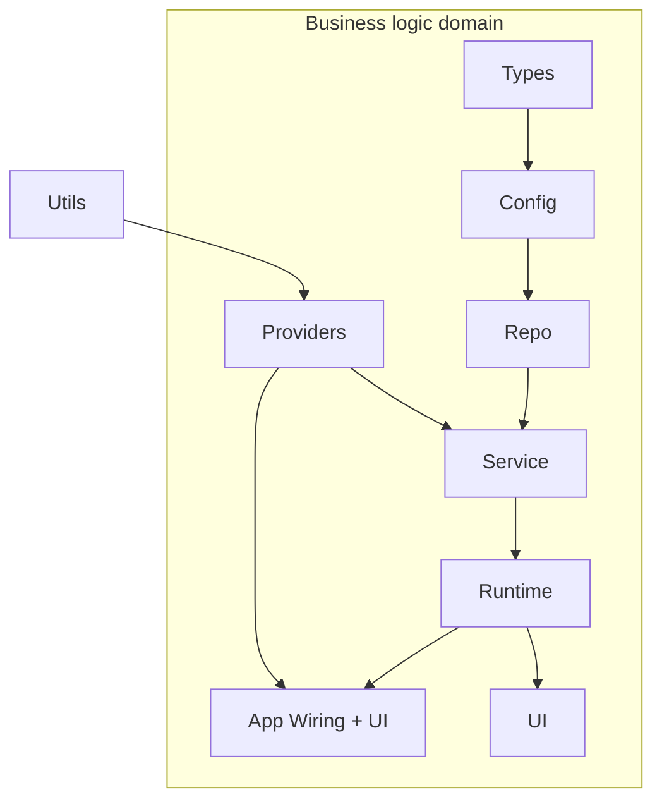

# Layered Domain Architecture — Harness Pattern

## What IS a Business Domain?

A business domain is a **self-contained vertical slice** of the product that a user or
stakeholder would recognize as a distinct capability. It maps to a real-world workflow,
not a technical concern.

**Litmus test**: Can you describe it to a non-engineer in one sentence?

- "Scheduling appointments" — Calendar domain
- "Managing patient records" — Patients domain
- "Collecting payments" — Payments domain
- "Finding and booking a sitter" — Booking domain
- "Sending messages between parties" — Messaging domain

**Is a domain**: Auth, Calendar, Patients, Forms, Treatments, Settings, Payments,
Booking, Messaging, Notifications, Search

**Is NOT a domain**: Networking, error handling, logging, design tokens, formatters,
persistence engines, animation utilities, accessibility helpers

A domain owns its full vertical: Config (interfaces) → Repo (data access) →
Service (logic) → UI (views). Cross-domain communication happens only through
delegate actions or explicit protocols — never by importing another domain's internals.

---

## The Layer Chain

Within each business domain, code can only depend "forward" through a fixed set of
layers. Cross-cutting concerns (auth, connectors, telemetry, feature flags) enter
through a single explicit interface: **Providers**. Anything else is disallowed and
enforced mechanically.

```
Types → Config → Repo → Service → Runtime → UI
```



### Dependency Direction

Arrows mean "feeds into" — if `A --> B`, then B depends on A. Reading
the dependency direction for each layer:

### Two relations, not one

The formal model (`architecture.als`) distinguishes **compile-time dependencies**
from **runtime data flow**. This distinction is the key to understanding the
architecture — and the key to catching violations that import scanning misses.

- **compileDependsOn** — what a layer can `import` (enforced by SPM / spec)
- **dataFlowsTo** — what data reaches at runtime (through Config closures)

| Statement | compileDependsOn | dataFlowsTo |
|-----------|:---:|:---:|
| Service uses Config interfaces | yes | yes |
| Service uses Repo implementations | **no** | yes (through Config closures) |
| UI accesses Repo directly | **no** | **no** |
| Runtime sees everything | yes | yes |

Service never `import Repo`. But Repo data reaches Service at runtime through
Config closures wired by Runtime. Both are true simultaneously.

### compileDependsOn (what you can `import`)

| Layer | compileDependsOn |
|-------|-----------------|
| **Types** | nothing |
| **Config** | Types |
| **Repo** | Config, Types |
| **Service** | Config, Types, Providers (**NOT Repo** — the wall) |
| **Runtime** | everything |
| **UI** | Runtime, Service, Config, Types |
| **App Wiring** | Runtime, Providers |
| **Providers** | Utils, Types |
| **Utils** | nothing |

### dataFlowsTo (what data reaches at runtime)

All compileDependsOn edges, plus:
- Repo **dataFlowsTo** Service — through Config closures wired by Runtime
- Providers **dataFlowsTo** Service — through Config closures

The reverse is **never** allowed in either relation. These are enforced
mechanically (SPM targets, harness-spec) and formally verified (architecture.als).

---

## Layer Definitions

### Types — The Universal Vocabulary

Pure data definitions that every layer can speak.

| Contains | Does NOT contain |
|----------|-----------------|
| `struct`/`enum` value types (`Appointment`, `Patient`, `BookingRequest`) | Business logic or computed decisions |
| Strongly-typed IDs (`EntityID<Tag>` → `AppointmentID`, `ListingID`) | Mutable state (`var` fields, `@State`, `@Observable`) |
| API operation specs (typed HTTP endpoint definitions) | Side effects, `async`/`await`, networking |
| `Codable`/`Equatable`/`Hashable`/`Sendable` conformances | Any import beyond `Foundation` |
| Typed error codes (`ProblemCode`, `BookingErrorCode`) | UI framework references (`SwiftUI`, `UIKit`) |
| Immutable fields (`let` only) | Persistence (`SwiftData`, `CoreData`, `GRDB`) |

**Guiding principle**: If you deleted every other layer, Types would still compile with
just `import Foundation`. It describes *what data looks like*, never *what to do with it*.

**Parse, don't validate**: Types should make illegal states unrepresentable.

```swift
// Bad — illegal states representable
struct Booking {
  let status: String      // could be anything
  let sitterId: String    // could be empty or malformed
  let dates: [Date]       // could be empty
}

// Good — illegal states unrepresentable
struct Booking {
  let status: BookingStatus   // enum: .pending, .confirmed, .cancelled
  let sitterId: SitterID      // newtype, validated at construction
  let dates: DateInterval     // always has start <= end
}
```

---

### Config — The Contract Layer

Declares what capabilities exist without knowing how they're implemented.

| Contains | Does NOT contain |
|----------|-----------------|
| `@DependencyClient` struct definitions with closure signatures | Concrete implementations of those closures |
| Value types that flow through clients (`AppointmentDraft`, `BookingConfig`) | `@Reducer`, business logic, state machines |
| `DependencyValues` extensions registering clients | `import Repo` — Config cannot see implementations |
| `TestDependencyKey` conformances for testability | `import SwiftUI` or `import UIKit` |
| Feature flags and environment-specific configuration | Networking, persistence, or SDK imports |

**Guiding principle**: Config is the **seam** between business logic and infrastructure.
It declares *what can be asked for* without saying *how*.

**Litmus test**: If a type describes *what you can ask for* (fetch, create, delete)
without saying *how*, it's Config. If it says *how* (URL, database query, retry logic),
it's Repo.

```swift
// Config — declares the capability
@DependencyClient
struct BookingDataClient {
  var fetch: @Sendable (BookingID) async throws -> Booking
  var create: @Sendable (BookingDraft) async throws -> Booking
  var cancel: @Sendable (BookingID) async throws -> Void
}
```

---

### Repo — The Infrastructure Bridge

Knows how to talk to the outside world — API, database, keychain, network — so that
nothing else has to. This is the **parsing boundary**: raw external data enters here
and well-typed domain objects exit.

| Contains | Does NOT contain |
|----------|-----------------|
| `APIClient`, HTTP transport, request/response handling | `@Reducer`, state machines, TCA actions |
| `SwiftData` `@Model` entities and local stores | SwiftUI views, `UIKit`, design tokens |
| Sync coordination (retry, queues, offline support) | Domain validation or business rules |
| Token refresh, keychain storage, app attestation | Knowledge of which feature uses the data |
| DTO-to-domain-type mapping at boundaries | Direct dependency on Service or Runtime |

**Guiding principle**: Repo answers "how do I get/store this data?" — never "what should
I do with it?" At boundaries, use `reportIssue` for optional defaults, `throw` for
missing required fields. Never silently swallow data.

```swift
// Repo — the parsing boundary
actor BookingRepository {
  func fetchBooking(id: BookingID) async throws -> Booking {
    let dto = try await apiClient.execute(FetchBooking(id: id))
    // Parse at boundary — everything downstream gets a typed Booking
    return try Booking(from: dto)
  }
}
```

---

### Service — The Brain

Pure business logic. No pixels, no network calls — just decisions.

In TCA codebases, Service is `@Reducer` state machines. In non-TCA codebases, Service
is pure functions and `@Observable` classes containing business rules.

Service depends on **Config** (interfaces) and **Providers** (cross-cutting), but
**never on Repo** (the serviceRepoWall invariant). Repo data reaches Service at
runtime through Config closures wired by Runtime — a compile-time wall with a
runtime bridge. Service does NOT depend on Runtime or UI.

| Contains | Does NOT contain |
|----------|-----------------|
| `@Reducer struct` with `State`, `Action`, `body` (TCA) | SwiftUI `View`, `ViewModifier`, `@State`, `@Binding` |
| `@ObservableState struct State: Equatable` | `import UIKit`, `import SwiftUI` |
| `@Dependency(ClientType.self)` injected interfaces | Design tokens, colors, fonts, spacing |
| `.run` effects calling client closures | `@Observable`, `@Published`, `@StateObject` |
| Parent-child composition (`Scope`, `CombineReducers`) | Direct dependency on Runtime |
| Delegate actions for cross-feature communication | |

**Guiding principle**: Service is **testable with `TestStore` and zero infrastructure**.
Every external interaction goes through a `@Dependency` client that can be swapped for
a test double. If you need to import SwiftUI to make it compile, it doesn't belong here.

**Forbidden attributes** (invariants): `@State`, `@Binding`, `@Observable`,
`@ObservableObject`, `@EnvironmentObject`, `@Published`, `@StateObject`

```swift
@Reducer
struct BookingFeature {
  @ObservableState
  struct State: Equatable {
    var phase: BookingPhase = .selecting(selections: .init())
  }

  enum Action {
    case confirmTapped
    case delegate(Delegate)
    @CasePathable enum Delegate: Equatable {
      case bookingCompleted(Booking)
    }
  }

  @Dependency(BookingDataClient.self) var bookingClient

  var body: some ReducerOf<Self> {
    Reduce { state, action in
      switch action {
      case .confirmTapped:
        guard case .readyToSubmit(let draft) = state.phase else { return .none }
        return .run { send in
          let booking = try await bookingClient.create(draft)
          await send(.delegate(.bookingCompleted(booking)))
        }
      case .delegate:
        return .none
      }
    }
  }
}
```

---

### Runtime — The Wiring Layer

Depends on Service. Holds state management and orchestration that bridges
Service logic to the UI layer.

| Contains | Does NOT contain |
|----------|-----------------|
| `@Observable` state containers | `@main` app entry point (that's App Wiring) |
| State orchestration bridging Service → UI | Reusable UI components (that's UI) |
| Navigation coordination | Data type definitions (that's Types) |
| Store creation and scoping | Interface definitions (that's Config) |

**Guiding principle**: Runtime depends on Service and exposes state that
UI can observe. It's the layer where business logic meets presentation
concerns — but it doesn't render pixels itself.

---

### UI — The Pixels

SwiftUI views and design system components that render state to the screen.

| Contains | Does NOT contain |
|----------|-----------------|
| SwiftUI `View` structs reading from `StoreOf<Feature>` | `@Reducer`, business logic, state machines |
| `ViewModifier`s, design system tokens, styles | Direct data access (`import Repo`) |
| `$store.send(.action)` dispatches | Async effects or `.run` blocks |
| Design tokens, typography, spacing | Network calls, persistence, auth logic |
| Previews (`#Preview`) | Dependency client definitions |
| Localization | |

**Guiding principle**: UI is a **pure function of state**. Given a `Store`, it renders
pixels. It sends actions back. It never fetches data, never decides business rules,
never knows where data came from.

---

### App Wiring — The Composition Root

The one place where all abstractions collapse into concrete reality.

| Contains | Does NOT contain |
|----------|-----------------|
| `@main` app entry point | Reusable business logic (that's Service) |
| `DependencyRegistry.configure()` — central DI wiring | Reusable UI components (that's UI) |
| Per-domain `Registration.swift` files | Data type definitions (that's Types) |
| Live service instantiation (concrete Repo wiring) | Interface definitions (that's Config) |
| UI test fake injection (`--uitesting` flags) | |

**Guiding principle**: App Wiring is a **leaf node** — nothing imports it. It imports
Runtime and Providers to compose the running application.

**Litmus test**: If removing this code means the app won't launch but all tests still
pass, it's App Wiring.

---

## Cross-Cutting Concerns

Capabilities that span all domains but aren't domains themselves. Two layers:

### Utils — Pure Helpers

**Dependencies**: Foundation only.

Formatters, constants, accessibility ID enums, error types, logging abstractions,
telemetry protocols. No domain knowledge, no side effects. Any layer can import Utils.

### Providers — SDK Bridges

**Dependencies**: Utils, Types.

Bridges abstract protocols (defined in Utils or Types) to concrete external SDKs.
Analytics initialization, telemetry configuration, UI test harness setup. Providers
enter the business domain at **Service** and **App Wiring** — the only two layers
that depend on them.

### Decision tree

- Is it a pure formatter, constant, or error type? → **Utils**
- Does it wrap an external SDK (Sentry, Stripe, Firebase)? → **Providers**
- Is it business logic specific to a workflow? → **It's a domain**, not cross-cutting

---

## Enforcement — Three Levels

Build-time enforcement is necessary but insufficient. It checks direct edges.
A formal model checks **reachability** — whether ANY chain of legal imports
creates a transitive path that violates an invariant. This catches gaming:
thin wrappers, re-export modules, type tunneling through generics.

### Level 1: Compile-time (direct edges)

**SPM target boundaries** — `import Repo` in a Config file produces a compiler
error. Strongest for direct violations. Weakest for transitive ones.

**Architecture spec** — `harness-spec.yml` or `dep4swift.json` defines
`allowed_imports` and `forbidden_imports` per layer. An audit tool reads the
spec and flags every file that doesn't match.

### Level 2: Formal verification (transitive reachability)

**Alloy6 model** (`architecture.als`) — Expresses invariants as assertions
over the transitive closure of the import graph. Catches:

- **Re-export gaming**: Config imports Repo (allowed), re-exports types.
  Service imports Config (allowed). Transitive path Service → Config → Repo
  violates `serviceRepoWall` even though no individual import is forbidden.
- **Cross-domain leakage**: Domain A's Service imports Domain B's Config
  (allowed), which imports Domain B's Service (forbidden but discovered
  transitively). The `crossDomainImportsAreClean` invariant catches this.
- **Completeness**: `domainsAreComplete` verifies every domain has Config +
  Service + UI — a property about the *set* of files, not any individual file.

### Level 3: Architecture boundary tests (runtime verification)

Tests that verify import statements and type references don't cross forbidden
boundaries. The safety net for violations that static analysis misses.

### How they compose

| Level | Checks | Catches | Misses |
|-------|--------|---------|--------|
| Compile-time | Direct imports | `import Repo` in Service | Re-exports, transitive paths |
| Formal model | Transitive reachability | Gaming, completeness, isolation | Runtime-only violations |
| Boundary tests | Import + type refs | Concrete violations in test | Unbounded state space |

The formal model is the spec. The compile-time checks enforce the easy cases.
The boundary tests catch what slips through. All three are needed.
