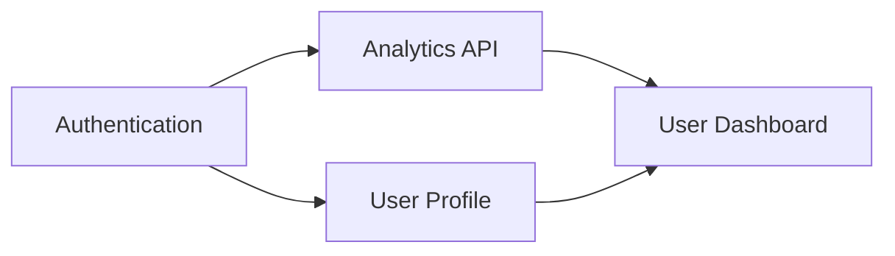

## Identify and Prioritize Dependencies

Map dependencies between features and prioritize blocking work first. A high-priority feature is useless if it depends on unfinished low-priority work. Dependencies determine actual execution order.

**Incorrect (ignoring dependencies):**

```markdown
## Sprint Planning

Sprint 1: User Dashboard (highest priority)
Sprint 2: Analytics API
Sprint 3: Authentication System

// Problem: Dashboard needs Analytics API
// Analytics API needs Authentication
// Sprint 1 work is blocked from day 1
```

**Correct (dependency-aware sequencing):**

```markdown
## Feature Dependencies



### Dependency Analysis

| Feature | Depends On | Blocks | Priority |
|---------|------------|--------|----------|
| Authentication | None | Analytics, Profile | P0 (Critical Path) |
| Analytics API | Authentication | Dashboard | P0 (Critical Path) |
| User Profile | Authentication | Dashboard | P1 |
| User Dashboard | Analytics, Profile | None | P1 |

### Revised Sprint Plan

**Sprint 1: Foundation (Unblock everything)**
- Authentication System (no dependencies)
- Begin Analytics API (parallel after auth done)

**Sprint 2: Data Layer**
- Complete Analytics API
- User Profile

**Sprint 3: UI Layer**
- User Dashboard (all dependencies satisfied)

### Critical Path
Authentication → Analytics API → Dashboard

_Any delay in critical path delays final delivery_
```

**Dependency management tips:**
- Identify dependencies during planning, not during sprint
- Prioritize work that unblocks other work
- Consider dependency cost in effort estimates
- Create interface contracts early to enable parallel work

Reference: [Eleken - Product Feature Prioritization](https://www.eleken.co/blog-posts/product-feature-prioritization)
