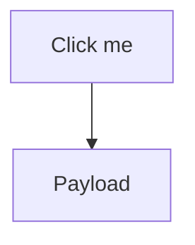

# Threat Model: dev-rfc Review UI

## Scope

This analysis covers the `skills/.experimental/dev-rfc/` skill, focusing on:

- **`assets/review_template.html`** -- The client-side HTML/JS that renders RFC markdown and collects user feedback.
- **`scripts/generate_review.ts`** -- The Bun-based HTTP server that serves the UI, handles feedback persistence, and manages live authoring sessions via SSE.
- **`scripts/generate_review.py`** -- The Python equivalent HTTP server (same functionality).
- **`SKILL.md`** -- The skill instructions that direct the AI agent how to invoke the review server.

The system takes user-submitted RFC markdown, renders it in a browser via a local HTTP server on `localhost:3118`, and allows users to annotate, comment, and submit feedback. It supports three modes: batch server, live authoring (with SSE), and static HTML export.

---

## Architecture Overview

```
RFC Markdown File (user-authored or agent-generated)
        |
        v
generate_review.ts / .py  (local HTTP server, 127.0.0.1:3118)
        |
        +--> GET /           --> buildHtml() injects markdown into review_template.html
        |                         via __MARKDOWN_CONTENT__ placeholder (JSON.stringify)
        |
        +--> POST /api/feedback  --> writes feedback.json to workspace dir
        +--> POST /api/section/* --> live mode: pushes sections via SSE
        +--> GET /events         --> SSE stream for live updates
        +--> GET /assets/*       --> serves bundled JS (marked, mermaid)
        |
        v
Browser (review_template.html)
        |
        +--> marked.parse()  converts markdown to HTML (NO sanitizer)
        +--> innerHTML        inserts parsed HTML into DOM
        +--> mermaid.run()   renders diagrams
        +--> shiki            syntax highlighting
```

---

## Threat Catalog

### T1: Stored XSS via Malicious Markdown Content (Critical)

**Attack Vector:** The RFC markdown is parsed by `marked.parse()` and inserted into the DOM via `innerHTML` without any HTML sanitization.

**Location:**
- `review_template.html` line 917: `const html = marked.parse(stripFrontmatter(MARKDOWN_CONTENT));`
- `review_template.html` line 919: `tmp.innerHTML = html;`
- `review_template.html` line 1510 (live mode): `const rendered = marked.parse(...); ... div.innerHTML = ...`
- `review_template.html` line 1700 (SSE update): `const rendered = marked.parse(...); ... content.innerHTML = ...`

**Details:** The `marked` library, by default, passes through raw HTML embedded in markdown. An RFC markdown document containing:

```markdown
## Abstract

This is a normal paragraph.


```

...will execute the JavaScript in the `onerror` handler when rendered. The `marked` library does not sanitize HTML unless explicitly configured to do so (e.g., with a `sanitizer` option or a library like DOMPurify as a post-processor).

**Impact:** Full JavaScript execution in the context of the review page. An attacker who can influence the markdown content (e.g., an AI agent producing adversarial content, a compromised upstream document, or a malicious contributor's RFC) can:
- Exfiltrate feedback data via network requests.
- Modify the rendered RFC to show different content than what is saved.
- Inject fake "Approve" button behavior that silently approves while showing rejection.
- Read/write to the local feedback API since the page runs on the same origin as the server.

**Severity:** Critical. The entire trust model of the review UI rests on the reviewer seeing the actual RFC content and providing honest feedback. XSS breaks both.

**Existing Mitigations:** None. There is no DOMPurify, no CSP header, no `marked` sanitizer configuration.

**Recommendation:** (1) Add DOMPurify as a post-processor after `marked.parse()`. The bundled `mermaid.min.js` already includes DOMPurify 3.3.1 -- extract and reuse it or add it separately. (2) Configure a Content-Security-Policy header that blocks inline scripts and restricts external resource loading.

---

### T2: XSS via Mermaid Diagram Injection (High)

**Attack Vector:** Mermaid code blocks are extracted from markdown and rendered via `mermaid.run()`. Mermaid diagrams support `click` callbacks and other interactive features that can execute JavaScript.

**Location:**
- `review_template.html` lines 1029-1037 (batch mode)
- `review_template.html` lines 1717-1727 (live mode)

**Details:** A malicious markdown document could include:

````markdown

````

While Mermaid v11 includes DOMPurify internally and mitigates many of these vectors, the `securityLevel` configuration defaults may not block all interaction-based payloads. The code uses `mermaid.initialize({ startOnLoad: false, theme: 'neutral' })` with no explicit `securityLevel: 'strict'` setting.

**Impact:** Potential JavaScript execution via diagram interaction, depending on Mermaid version-specific behavior.

**Severity:** High. Partially mitigated by Mermaid's built-in DOMPurify but not explicitly locked down.

**Recommendation:** Set `securityLevel: 'strict'` in the `mermaid.initialize()` call to disable click callbacks and other interactive features entirely.

---

### T3: Server-Side Template Injection via Title Parameter (Medium)

**Attack Vector:** The `__DOC_TITLE__` placeholder is injected into the HTML template in two contexts -- once inside a `<title>` tag (line 6) and once inside a `<span>` element (line 842). The server-side escaping only replaces double-quotes with `&quot;`.

**Location:**
- `generate_review.ts` line 323: `html = html.replace("__DOC_TITLE__", title.replace(/"/g, "&quot;"));`
- `generate_review.py` line 249: `html = html.replace("__DOC_TITLE__", title.replace('"', "&quot;"))`

**Details:** The title is provided via the `--title` CLI argument, which is controlled by the AI agent (as instructed in SKILL.md). If the title contains characters like `<`, `>`, or `'`, they will be injected raw into the HTML. For example, a title of `<script>alert(1)</script>` would execute JavaScript.

A realistic attack scenario: the agent derives the title from user input or project name. A repository named `My Project` would inject HTML.

**Impact:** JavaScript execution in the rendered page. Lower severity than T1 because the title typically comes from the agent (which the user controls), not from external untrusted input.

**Severity:** Medium. The attack requires influencing the `--title` CLI argument, which is under the agent's control.

**Recommendation:** Apply full HTML entity encoding to the title, not just quote escaping. Replace `<`, `>`, `&`, `'`, and `"` with their HTML entity equivalents.

---

### T4: Arbitrary File Write via Feedback Path (Medium)

**Attack Vector:** The server writes user-submitted feedback JSON to a path derived from the markdown file's directory or the `--workspace` argument. The `POST /api/feedback` endpoint accepts arbitrary JSON and writes it verbatim to `feedback.json`.

**Location:**
- `generate_review.ts` lines 470-488
- `generate_review.py` lines 415-426

**Details:** While the server binds to `127.0.0.1` (limiting access to local processes), any local process or browser tab (via fetch from any localhost origin, since there are no CORS restrictions) can POST arbitrary JSON to `/api/feedback`. The written path is not user-controllable (it is derived from server startup args), but the content is.

A more concerning variant: if the workspace path can be influenced (e.g., an agent constructing a `--workspace` pointing to a sensitive directory), the `feedback.json` file could overwrite or be placed alongside sensitive files.

**Impact:** Arbitrary JSON content written to a predictable file path on disk. Could be used for configuration injection if the feedback.json path overlaps with a location read by other tools.

**Severity:** Medium. Requires local access (server binds to 127.0.0.1) and the file path is constrained.

**Recommendation:** Validate that the workspace directory is within expected boundaries. Consider adding a nonce or session token to the feedback API.

---

### T5: Missing CORS Headers -- Cross-Origin Request Forgery (Medium)

**Attack Vector:** The HTTP server does not set any CORS headers. Since it runs on `localhost:3118`, any website open in the user's browser can send requests to `http://localhost:3118/api/*` and read the responses (for simple requests) or trigger state changes (POST endpoints).

**Location:** Neither `generate_review.ts` nor `generate_review.py` set `Access-Control-Allow-Origin` headers.

**Details:** Modern browsers enforce CORS, which means a cross-origin `fetch()` from `https://evil.com` to `http://localhost:3118/api/feedback` will be blocked for responses. However:

1. **Simple POST requests** (with `Content-Type: application/json`) are actually preflighted, so the browser will block them. But `Content-Type: text/plain` POSTs are not preflighted and can trigger `do_POST` -- the server reads the body regardless of Content-Type.
2. **`<form>` submissions** to `http://localhost:3118/api/feedback` with `enctype="text/plain"` bypass CORS entirely and can write data.
3. **GET requests** to `/api/session` or `/api/feedback` from cross-origin pages will be sent (the request fires), though the response may not be readable.

A malicious website could silently submit "approved" feedback to the local server while the user has the review UI open.

**Impact:** An attacker-controlled website could approve or inject feedback into an active RFC review session without the user's knowledge.

**Severity:** Medium. Requires the user to visit a malicious page while the review server is running.

**Recommendation:** (1) Add CORS headers restricting access to the same origin. (2) Require a session token in API requests that is embedded in the HTML page (a CSRF token pattern). (3) Validate Content-Type header on POST endpoints.

---

### T6: Process Killing via Port Cleanup (Medium)

**Attack Vector:** The `killPort()` function uses `lsof -ti :PORT` and then `process.kill(pid, SIGTERM)` to clear the port before starting the server. If another application is legitimately using port 3118, it will be killed.

**Location:**
- `generate_review.ts` lines 23-58
- `generate_review.py` lines 30-61

**Details:** The function blindly kills whatever process is on the configured port. An attacker who places a process on port 3118 can cause the review server to kill that process, or more practically, a user running another service on the same port will have it terminated. The port number is configurable via `--port`, but the default of 3118 is hardcoded.

Additionally, on Linux, `fuser -k` kills all processes using the port, which could affect unrelated processes sharing the port.

**Impact:** Denial of service for other local applications. Not a direct security vulnerability but a reliability and safety concern.

**Severity:** Medium (operational risk, not a confidentiality/integrity issue).

**Recommendation:** Check if the port is in use and prompt/error rather than silently killing. Alternatively, find a free port automatically.

---

### T7: Unvalidated JSON Write -- No Schema Validation on Feedback API (Low)

**Attack Vector:** The `POST /api/feedback` endpoint accepts any valid JSON object and writes it directly to disk without schema validation.

**Location:**
- `generate_review.ts` lines 470-488
- `generate_review.py` lines 415-426

**Details:** The only validation is that the body is a JSON object (`typeof data !== "object"`). There is no check on the structure, size, or content. A request could send:

```json
{"__proto__": {"polluted": true}, "constructor": {"prototype": {"polluted": true}}}
```

While this does not directly cause prototype pollution (it is written to a file, not merged into an object), if the feedback JSON is later consumed by another tool using `Object.assign()` or similar, it could become a vector.

More practically, an extremely large JSON payload could fill disk space since there is no size limit on the request body.

**Impact:** Low. Potential for disk exhaustion or downstream prototype pollution if feedback is unsafely consumed.

**Severity:** Low.

**Recommendation:** Add a maximum body size check (e.g., 1MB). Validate the feedback JSON against an expected schema before writing.

---

### T8: CDN Dependency Integrity -- No Subresource Integrity (Low)

**Attack Vector:** The review template loads `marked` and `mermaid` from CDN URLs with fallback to local copies, and loads `shiki` from `esm.sh`. None of these have Subresource Integrity (SRI) hashes.

**Location:**
- `review_template.html` line 8: `<script src="https://cdn.jsdelivr.net/npm/marked@15/marked.min.js">`
- `review_template.html` line 10: `<script src="https://cdn.jsdelivr.net/npm/mermaid@11/dist/mermaid.min.js">`
- `review_template.html` line 13: `import { codeToHtml } from 'https://esm.sh/shiki@3/bundle/web';`

**Details:** If a CDN is compromised or a MITM attack intercepts the request, the attacker could serve modified JavaScript. The local fallback files (`/assets/marked.min.js`, `/assets/mermaid.min.js`) mitigate this for `marked` and `mermaid` if the CDN is unreachable, but not if the CDN serves a malicious response. Shiki has no local fallback.

**Impact:** Full JavaScript execution if a CDN is compromised. Low probability but high impact.

**Severity:** Low (localhost-only service reduces the attack surface for MITM).

**Recommendation:** Add SRI hashes to CDN script tags. Consider serving all dependencies from local assets to eliminate CDN dependency entirely.

---

### T9: Live Mode Section ID Injection (Low)

**Attack Vector:** In live mode, section IDs are either derived from `slugify(heading)` or directly provided in the `id` field of POST requests. The section ID is used in `data-section-id` attributes and in DOM queries like `document.querySelector(`.section[data-section-id="${sectionId}"]`)`.

**Location:**
- `review_template.html` line 1629: `document.querySelector(`.section[data-section-id="${sectionId}"]`)`
- `review_template.html` line 1541: `onclick="submitLiveFeedback('${sectionId}', 'approve')"`

**Details:** In the `addLiveActionButtons` function, the `sectionId` is interpolated directly into an `onclick` attribute string:

```js
onclick="submitLiveFeedback('${sectionId}', 'approve')"
```

If the section ID contains a single quote, it would break out of the string and allow JavaScript injection. However, the `slugify()` function strips all characters except `a-z0-9\s-`, so IDs derived from headings are safe. But in the API, the `id` field can be provided directly without slugification:

```js
const sectionId = data.id || slugify(heading);
```

An agent (or any HTTP client) could POST a section with `id: "'; alert(1); '"` which would not go through `slugify`.

**Impact:** JavaScript injection via crafted section IDs in live mode. Requires an attacker who can POST to the live API (local access only).

**Severity:** Low. Requires local HTTP access and live mode to be active.

**Recommendation:** Always run section IDs through `slugify()` on the server side, regardless of whether a custom `id` is provided in the request.

---

### T10: Static Mode File URI -- No Origin Isolation (Low)

**Attack Vector:** In static mode, the HTML file is opened via `file://` protocol. Pages loaded via `file://` have relaxed same-origin policy in some browsers, potentially allowing the static HTML to read other local files.

**Location:**
- `generate_review.ts` line 722-723: writes to `/tmp/` and opens via `file://`
- `generate_review.py` line 571: opens via `file://`

**Details:** The static mode writes the full HTML (including embedded markdown) to `/tmp/` with a predictable filename (`dev-rfc-review-{basename}.html`). If an attacker knows the filename, they could pre-plant a symlink at that path. The file also includes the full markdown content embedded as a JSON string, so any local process that can read `/tmp/` can access the RFC content.

**Impact:** Information disclosure of RFC content to local processes. Potential symlink attacks on the output path.

**Severity:** Low. Only applies in static mode, which is the legacy fallback.

**Recommendation:** Use `mktemp` for the output path to avoid predictable filenames. Consider writing to the workspace directory instead of `/tmp/`.

---

## Risk Summary

| ID | Threat | Severity | Exploitability |
|----|--------|----------|----------------|
| T1 | Stored XSS via markdown content (no sanitization) | **Critical** | Easy -- any embedded HTML in markdown executes |
| T2 | XSS via Mermaid diagram injection | **High** | Moderate -- depends on Mermaid version config |
| T3 | HTML injection via title parameter | **Medium** | Moderate -- requires influencing CLI args |
| T4 | Arbitrary file write via feedback API | **Medium** | Requires local access |
| T5 | Cross-origin request forgery (no CORS/CSRF) | **Medium** | Requires user to visit malicious page |
| T6 | Process killing via port cleanup | **Medium** | Operational risk |
| T7 | Unvalidated JSON write (no schema/size limit) | **Low** | Requires local access |
| T8 | CDN compromise (no SRI hashes) | **Low** | Requires CDN compromise or MITM |
| T9 | Section ID injection in live mode | **Low** | Requires local API access |
| T10 | Static mode file URI issues | **Low** | Legacy fallback only |

---

## Priority Remediation

1. **Immediate: Add DOMPurify sanitization after `marked.parse()`** (fixes T1). This is the single highest-impact fix. Every call to `marked.parse()` should be wrapped with `DOMPurify.sanitize()`.

2. **Short-term: Set Mermaid `securityLevel: 'strict'`** (fixes T2). One-line configuration change.

3. **Short-term: Apply proper HTML entity encoding to `__DOC_TITLE__`** (fixes T3). Replace `<`, `>`, `&`, `'`, `"` with HTML entities.

4. **Medium-term: Add CSRF protection to the API** (fixes T5). Embed a random token in the HTML page and require it in API requests.

5. **Medium-term: Add Content-Security-Policy header** (defense-in-depth for T1, T2, T8). Restrict `script-src` to `'self'` and trusted CDN origins.
