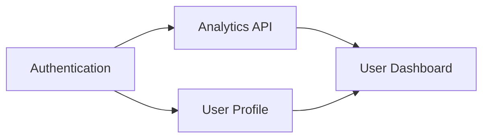

# Feature Specification and Planning

**Version 1.0.0**  
Software Engineering  
January 2026

> **Note:**  
> This document is mainly for agents and LLMs to follow when maintaining,  
> generating, or refactoring codebases. Humans may also find it useful,  
> but guidance here is optimized for automation and consistency by AI-assisted workflows.

---

## Abstract

Comprehensive feature specification and planning guide for software engineers, product managers, and technical leads. Contains 42 rules across 8 categories, prioritized by impact from critical (scope definition, requirements clarity) to foundational (documentation standards). Each rule includes detailed explanations, real-world examples comparing incorrect vs. correct approaches, and specific impact metrics to prevent scope creep and ensure project success.

---

## Table of Contents

1. [Scope Definition](#1-scope-definition) — **CRITICAL**
   - 1.1 [Create Work Breakdown Structure for Complex Features](#11-create-work-breakdown-structure-for-complex-features)
   - 1.2 [Define Explicit In-Scope and Out-of-Scope Boundaries](#12-define-explicit-in-scope-and-out-of-scope-boundaries)
   - 1.3 [Define MVP Separately from Full Vision](#13-define-mvp-separately-from-full-vision)
   - 1.4 [Document Assumptions and Constraints Early](#14-document-assumptions-and-constraints-early)
   - 1.5 [Obtain Stakeholder Sign-off on Scope](#15-obtain-stakeholder-sign-off-on-scope)
2. [Requirements Clarity](#2-requirements-clarity) — **CRITICAL**
   - 2.1 [Maintain Requirements Traceability](#21-maintain-requirements-traceability)
   - 2.2 [Separate Functional and Non-Functional Requirements](#22-separate-functional-and-non-functional-requirements)
   - 2.3 [State Requirements Without Prescribing Solutions](#23-state-requirements-without-prescribing-solutions)
   - 2.4 [Use Consistent Terminology with a Glossary](#24-use-consistent-terminology-with-a-glossary)
   - 2.5 [Use User Story Format for Feature Requirements](#25-use-user-story-format-for-feature-requirements)
   - 2.6 [Write Specific and Measurable Requirements](#26-write-specific-and-measurable-requirements)
3. [Prioritization](#3-prioritization) — **HIGH**
   - 3.1 [Identify and Prioritize Dependencies](#31-identify-and-prioritize-dependencies)
   - 3.2 [Map Features by Value vs Effort](#32-map-features-by-value-vs-effort)
   - 3.3 [Use Kano Model for Customer Satisfaction Prioritization](#33-use-kano-model-for-customer-satisfaction-prioritization)
   - 3.4 [Use MoSCoW Method for Scope Prioritization](#34-use-moscow-method-for-scope-prioritization)
   - 3.5 [Use RICE Scoring for Data-Driven Prioritization](#35-use-rice-scoring-for-data-driven-prioritization)
4. [Acceptance Criteria](#4-acceptance-criteria) — **HIGH**
   - 4.1 [Avoid Over-Specifying Acceptance Criteria](#41-avoid-over-specifying-acceptance-criteria)
   - 4.2 [Ensure All Criteria Are Testable](#42-ensure-all-criteria-are-testable)
   - 4.3 [Establish Definition of Done Beyond Code](#43-establish-definition-of-done-beyond-code)
   - 4.4 [Include Edge Cases in Acceptance Criteria](#44-include-edge-cases-in-acceptance-criteria)
   - 4.5 [Use Given-When-Then Format for Acceptance Criteria](#45-use-given-when-then-format-for-acceptance-criteria)
5. [Stakeholder Alignment](#5-stakeholder-alignment) — **MEDIUM-HIGH**
   - 5.1 [Align on Success Metrics Before Building](#51-align-on-success-metrics-before-building)
   - 5.2 [Establish Stakeholder Communication Cadence](#52-establish-stakeholder-communication-cadence)
   - 5.3 [Gather Stakeholder Feedback Early and Often](#53-gather-stakeholder-feedback-early-and-often)
   - 5.4 [Identify All Stakeholders Early](#54-identify-all-stakeholders-early)
   - 5.5 [Resolve Stakeholder Conflicts Explicitly](#55-resolve-stakeholder-conflicts-explicitly)
6. [Technical Specification](#6-technical-specification) — **MEDIUM**
   - 6.1 [Define API Contracts Before Implementation](#61-define-api-contracts-before-implementation)
   - 6.2 [Document Security Considerations](#62-document-security-considerations)
   - 6.3 [Document System Context and Dependencies](#63-document-system-context-and-dependencies)
   - 6.4 [Plan Error Handling and Recovery](#64-plan-error-handling-and-recovery)
   - 6.5 [Specify Data Models and Schema Changes](#65-specify-data-models-and-schema-changes)
   - 6.6 [Specify Performance Requirements Upfront](#66-specify-performance-requirements-upfront)
7. [Change Management](#7-change-management) — **MEDIUM**
   - 7.1 [Assess Full Impact Before Approving Changes](#71-assess-full-impact-before-approving-changes)
   - 7.2 [Implement Scope Freeze Periods](#72-implement-scope-freeze-periods)
   - 7.3 [Maintain a Deferred Items Log](#73-maintain-a-deferred-items-log)
   - 7.4 [Use Formal Change Request Process](#74-use-formal-change-request-process)
   - 7.5 [Version All Specification Documents](#75-version-all-specification-documents)
8. [Documentation Standards](#8-documentation-standards) — **LOW**
   - 8.1 [Define Project Terminology in a Glossary](#81-define-project-terminology-in-a-glossary)
   - 8.2 [Document Key Decisions with Context](#82-document-key-decisions-with-context)
   - 8.3 [Keep Documentation Accessible and Searchable](#83-keep-documentation-accessible-and-searchable)
   - 8.4 [Maintain Single Source of Truth](#84-maintain-single-source-of-truth)
   - 8.5 [Use Consistent Document Templates](#85-use-consistent-document-templates)

---

## 1. Scope Definition

**Impact: CRITICAL**

Clear scope boundaries prevent scope creep, which causes over 40% of project failures. Defining what's in and out of scope upfront enables accurate estimation and stakeholder alignment.

### 1.1 Create Work Breakdown Structure for Complex Features

**Impact: CRITICAL (reduces estimation error by 50%)**

Break large features into smaller, estimable work items using a Work Breakdown Structure (WBS). Large, monolithic features hide complexity and lead to underestimation. Decomposition reveals true scope.

**Incorrect (monolithic feature):**

```markdown
## Feature: User Dashboard

### Description
Build a dashboard showing user analytics and activity.

### Estimate
2 sprints (rough guess)

// Hidden complexity: API design, caching, charts, permissions, mobile
// Actual delivery: 5 sprints
```

**Correct (decomposed work breakdown):**

```markdown
## Feature: User Dashboard

### Work Breakdown Structure

1. **Data Layer** (Sprint 1)
   - 1.1 Define dashboard data models (2 pts)
   - 1.2 Create aggregation queries (3 pts)
   - 1.3 Implement caching layer (3 pts)
   - 1.4 Build REST API endpoints (5 pts)

2. **Visualization Components** (Sprint 2)
   - 2.1 Activity timeline component (3 pts)
   - 2.2 Analytics charts (bar, line, pie) (5 pts)
   - 2.3 Summary cards with KPIs (2 pts)
   - 2.4 Date range picker (2 pts)

3. **Dashboard Assembly** (Sprint 3)
   - 3.1 Layout and grid system (3 pts)
   - 3.2 Widget drag-and-drop (5 pts)
   - 3.3 Responsive design (3 pts)
   - 3.4 Loading states and skeletons (2 pts)

4. **Integration & Polish** (Sprint 4)
   - 4.1 Permission-based widget visibility (3 pts)
   - 4.2 Export to PDF/CSV (3 pts)
   - 4.3 Performance optimization (2 pts)
   - 4.4 E2E testing (3 pts)

### Total: 49 story points across 4 sprints
```

**WBS principles:**
- Each item should be independently estimable
- Aim for items under 8 story points
- Reveal dependencies between items
- Enable parallel work streams

Reference: [Planio - 7 Steps to Deal With Scope Creep](https://plan.io/blog/scope-creep/)

### 1.2 Define Explicit In-Scope and Out-of-Scope Boundaries

**Impact: CRITICAL (prevents 40% of project failures from scope creep)**

Explicitly state what the feature will and will not do. Ambiguous boundaries lead to scope creep, where stakeholders assume capabilities that were never planned, causing timeline and budget overruns.

**Incorrect (implicit boundaries):**

```markdown
## Feature: User Authentication

### Description
Users should be able to log in to the application securely.

### Requirements
- Login form with email and password
- Session management
- Password reset functionality
```

**Correct (explicit boundaries):**

```markdown
## Feature: User Authentication

### In Scope
- Email/password login form
- Session management with 24-hour expiry
- Password reset via email link
- Failed login attempt limiting (5 attempts)

### Out of Scope (Future Phases)
- Social login (Google, GitHub) - Phase 2
- Two-factor authentication - Phase 2
- Single sign-on (SSO) - Enterprise tier
- Biometric authentication - Mobile app only

### Explicitly Excluded
- Username-based login (email only)
- "Remember me" functionality (security policy)
```

**Benefits:**
- Stakeholders know exactly what to expect
- Developers can push back on creep with documented boundaries
- Future phases are acknowledged but deferred

Reference: [Asana - What is Scope Creep](https://asana.com/resources/what-is-scope-creep)

### 1.3 Define MVP Separately from Full Vision

**Impact: CRITICAL (enables faster time-to-value)**

Separate the Minimum Viable Product (MVP) from the complete feature vision. This enables faster delivery of core value while deferring nice-to-have functionality to later iterations.

**Incorrect (all-or-nothing feature):**

```markdown
## Feature: Notification System

### Requirements
- Email notifications
- Push notifications (iOS, Android, Web)
- SMS notifications
- In-app notification center
- Notification preferences UI
- Digest/batching options
- Template management system
- Analytics and delivery tracking

### Timeline
6 sprints to deliver complete system
```

**Correct (MVP vs full vision):**

```markdown
## Feature: Notification System

### MVP (Sprints 1-2)
**Goal:** Users receive critical notifications via email

- Email notifications for key events only:
  - Account creation
  - Password reset
  - Payment confirmation
- Basic unsubscribe link
- Hardcoded templates (no management UI)

**Success criteria:** 95% delivery rate, <5 min latency

---

### Phase 2 (Sprints 3-4)
- In-app notification center
- Read/unread status tracking
- Notification preferences UI

### Phase 3 (Sprints 5-6)
- Push notifications (mobile + web)
- Digest/batching options

### Future Backlog
- SMS notifications
- Template management system
- Analytics dashboard

---

### Why This Ordering
1. Email covers 80% of notification use cases
2. In-app center reduces email volume
3. Push is additive, not blocking
```

**MVP definition checklist:**
- [ ] Delivers core value to users
- [ ] Can be shipped independently
- [ ] Enables learning before over-investing
- [ ] Clear success criteria defined

Reference: [Product School - PRD Template](https://productschool.com/blog/product-strategy/product-template-requirements-document-prd)

### 1.4 Document Assumptions and Constraints Early

**Impact: CRITICAL (prevents mid-project surprises and rework)**

Assumptions are conditions believed to be true that haven't been validated. Constraints are fixed limitations. Documenting both early allows validation before coding starts, preventing costly mid-project discoveries.

**Incorrect (undocumented assumptions):**

```markdown
## Feature: Payment Processing

### Requirements
- Accept credit card payments
- Process refunds
- Generate invoices

// Team assumes: existing payment provider, USD only, no taxes
// Reality discovered in sprint 3: new provider needed, multi-currency required
// Result: 3-week delay for integration rework
```

**Correct (explicit assumptions and constraints):**

```markdown
## Feature: Payment Processing

### Assumptions (To Be Validated)
- [ ] Stripe account is already configured and approved
- [ ] All transactions will be in USD initially
- [ ] Sales tax calculation is handled by a separate service
- [ ] PCI compliance is managed at infrastructure level

### Constraints (Fixed Limitations)
- Must use Stripe (contractual obligation)
- Maximum transaction: $10,000 (fraud policy)
- Refund window: 30 days (business policy)
- No cryptocurrency payments (regulatory)

### Dependencies
- Tax calculation service must be deployed first
- Legal team must approve terms of service copy

### Validation Plan
1. Week 1: Confirm Stripe account status with finance
2. Week 1: Verify tax service API availability
3. Week 2: Legal review of payment terms
```

**When to validate assumptions:**
- Before sprint planning
- When assumptions affect architecture
- When cost of being wrong is high

Reference: [JHK InfoTech - Software Product Specification](https://www.jhkinfotech.com/blog/software-product-specification)

### 1.5 Obtain Stakeholder Sign-off on Scope

**Impact: CRITICAL (prevents scope disputes and rejected deliverables)**

Require explicit stakeholder approval of scope before development begins. Verbal agreements lead to "I thought it would include X" disputes. Written sign-off creates accountability and shared understanding.

**Incorrect (verbal agreement):**

```markdown
## Feature: Reporting Dashboard

Status: Discussed in meeting, ready to start

Meeting notes:
- Bob wants sales reports
- Sarah mentioned export functionality
- Everyone seemed aligned

// 4 weeks later:
// Bob: "Where are the predictive analytics?"
// Sarah: "I assumed PDF export, not just CSV"
// Result: Scope dispute, delayed delivery
```

**Correct (documented sign-off):**

```markdown
## Feature: Reporting Dashboard

### Scope Agreement

**Version:** 1.0
**Date:** 2024-03-15

#### Included in This Release
- Sales report with date filtering
- Revenue breakdown by product category
- CSV export functionality
- Weekly email digest option

#### Explicitly Excluded
- Predictive analytics (Phase 2)
- PDF export (requires design work)
- Real-time updates (polling every 5 min instead)
- Custom report builder

#### Sign-off

| Stakeholder | Role | Date | Signature |
|-------------|------|------|-----------|
| Bob Smith | Sales Director | 2024-03-15 | ✓ Approved |
| Sarah Jones | Product Manager | 2024-03-15 | ✓ Approved |
| Dev Lead | Engineering | 2024-03-15 | ✓ Feasible |

#### Change Process
Any scope changes after sign-off require:
1. Written change request
2. Impact analysis (timeline, cost)
3. Re-approval from all signatories
```

**Sign-off process:**
1. Document scope in writing
2. Review with all stakeholders
3. Address questions and concerns
4. Obtain explicit approval (email, signature)
5. Archive approved document

Reference: [Adobe - What is Scope Creep](https://business.adobe.com/blog/basics/scope-creep)

---

## 2. Requirements Clarity

**Impact: CRITICAL**

Vague requirements cause costly rework and interpretation disputes. Specific, testable requirements enable accurate estimation and reduce development waste by 30-50%.

### 2.1 Maintain Requirements Traceability

**Impact: CRITICAL (catches 95% of missing requirements before launch)**

Track each requirement from origin through implementation to testing. Traceability ensures no requirement is forgotten, enables impact analysis for changes, and proves compliance for audits.

**Incorrect (disconnected artifacts):**

```markdown
## Somewhere in Confluence:
REQ-001: User authentication

## Somewhere in Jira:
FEAT-123: Login page
BUG-456: Password reset broken

## Somewhere in GitHub:
PR #789: Add auth middleware

// No way to verify:
// - Is REQ-001 fully implemented?
// - What tests cover REQ-001?
// - What code implements REQ-001?
```

**Correct (traceability matrix):**

```markdown
## Requirements Traceability Matrix

| Req ID | Requirement | User Stories | Code | Tests | Status |
|--------|-------------|--------------|------|-------|--------|
| REQ-001 | User can log in with email/password | US-101, US-102 | auth/login.ts | login.spec.ts | ✓ Done |
| REQ-002 | User can reset password via email | US-103 | auth/reset.ts | reset.spec.ts | ✓ Done |
| REQ-003 | Session expires after 24h inactivity | US-104 | auth/session.ts | session.spec.ts | In Progress |
| REQ-004 | Failed login locks account after 5 attempts | US-105 | - | - | Not Started |

---

## Detailed Trace: REQ-001

**Requirement:** User can log in with email/password

**Business Need:** Security team mandate, Compliance SOC2

**User Stories:**
- US-101: Basic login flow
- US-102: Login error handling

**Implementation:**
- `src/auth/login.ts` - Login logic
- `src/auth/middleware.ts` - Session validation
- `src/components/LoginForm.tsx` - UI component

**Tests:**
- `login.spec.ts` - Unit tests
- `auth.e2e.ts` - E2E login flow
- `security.test.ts` - Penetration test cases

**Verification:** QA sign-off 2024-03-15
```

**Traceability benefits:**
- Impact analysis: "If REQ-003 changes, what's affected?"
- Coverage verification: "Are all requirements tested?"
- Audit compliance: "Prove REQ-001 is implemented"
- Progress tracking: "What percentage complete?"

Reference: [Aha! - Requirements Management](https://www.aha.io/roadmapping/guide/requirements-management/what-is-a-prd-(product-requirements-document))

### 2.2 Separate Functional and Non-Functional Requirements

**Impact: CRITICAL (prevents 75% of late-stage NFR surprises)**

Functional requirements describe what the system does. Non-functional requirements describe how well it does it (performance, security, accessibility). Both are essential; non-functional requirements are often overlooked until too late.

**Incorrect (only functional requirements):**

```markdown
## Feature: File Upload

### Requirements
- User can upload files
- Files are stored in the system
- User can download uploaded files
- User can delete files

// No mention of: file size limits, upload speed, security,
// concurrent uploads, storage quotas, virus scanning
```

**Correct (functional + non-functional):**

```markdown
## Feature: File Upload

### Functional Requirements
- User can upload single or multiple files
- User can view list of uploaded files with metadata
- User can download files individually or as ZIP
- User can delete files they own
- Admin can delete any file

### Non-Functional Requirements

#### Performance
- Upload speed: Minimum 1MB/s on broadband
- Maximum file size: 100MB per file
- Concurrent uploads: Up to 5 files simultaneously
- Storage quota: 10GB per user (configurable)

#### Security
- Files scanned for malware before storage
- Direct URL access requires authentication token
- Files encrypted at rest (AES-256)
- Audit log of all file operations

#### Availability
- File service uptime: 99.9%
- Graceful degradation if storage is unavailable
- Upload resume capability for files >10MB

#### Accessibility
- Upload progress announced to screen readers
- Keyboard-accessible file picker
- Error messages include remediation steps
```

**Common NFR categories:**
- Performance (speed, throughput, latency)
- Security (authentication, encryption, audit)
- Scalability (users, data volume, growth)
- Availability (uptime, disaster recovery)
- Accessibility (WCAG compliance level)
- Compliance (GDPR, HIPAA, SOC2)

Reference: [Document360 - Technical Specification Document](https://document360.com/blog/technical-specification-document/)

### 2.3 State Requirements Without Prescribing Solutions

**Impact: CRITICAL (enables optimal technical solutions)**

Requirements should describe what the system must do, not how to implement it. Prescribing solutions constrains developers and may result in suboptimal implementations.

**Incorrect (solution prescribed):**

```markdown
## Requirements

- Use Redis to cache user sessions
- Implement a modal dialog for confirmations
- Store files in AWS S3 buckets
- Use websockets for real-time updates
- Add a dropdown menu for category selection
```

**Correct (intent without solution):**

```markdown
## Requirements

### Session Management
- Sessions must persist across page refreshes
- Sessions must expire after 24 hours of inactivity
- Session data must be accessible from any server instance

_Implementation note: Team to decide caching solution (Redis, Memcached, database-backed)_

### Confirmation UX
- User must confirm before destructive actions (delete, cancel)
- Confirmation must clearly state the consequence
- User must be able to cancel without data loss

_Implementation note: Modal, inline confirmation, or separate page—team decides based on context_

### File Storage
- Uploaded files must be accessible for 7 days minimum
- Files must be retrievable via unique URL
- Maximum file size: 50MB

_Implementation note: Storage provider selection is a technical decision_

### Real-time Updates
- Users must see new messages within 5 seconds
- No manual refresh required for updates
- Updates must work on mobile networks

_Implementation note: Websockets, SSE, or polling—based on infrastructure constraints_
```

**When to specify implementation:**
- Regulatory/compliance requirements mandate specific technology
- Existing infrastructure constrains options
- Team has explicitly requested guidance

Reference: [Jama Software - How to Write an Effective PRD](https://www.jamasoftware.com/requirements-management-guide/writing-requirements/how-to-write-an-effective-product-requirements-document/)

### 2.4 Use Consistent Terminology with a Glossary

**Impact: CRITICAL (eliminates cross-team miscommunication)**

When different documents use different terms for the same concept—"user" vs "customer" vs "account holder"—confusion spreads. Create a glossary defining key terms and use them consistently throughout all specifications.

**Incorrect (inconsistent terminology):**

```markdown
## Requirements Document

The **user** can create an account...
The **customer** profile includes...
The **account holder** receives notifications...
A **member** can upgrade their subscription...
The **subscriber** dashboard shows...

// Are these all the same person? Different roles?
// Developers guess; QA interprets differently; bugs ensue
```

**Correct (glossary + consistent usage):**

```markdown
## Glossary

| Term | Definition | NOT to be confused with |
|------|------------|------------------------|
| **User** | Any person interacting with the system | Account (the data record) |
| **Member** | User with an active paid subscription | User (may be free tier) |
| **Account** | The data record representing a user | User (the person) |
| **Workspace** | Shared environment for team collaboration | Account (individual user data) |
| **Admin** | User with elevated permissions in a workspace | Owner (billing responsibility) |
| **Owner** | User responsible for billing | Admin (may not have admin rights) |

---

## Requirements (Using Consistent Terms)

### Account Creation
- A **user** can create an **account** with email/password
- The **account** stores the **user's** profile data

### Subscription Management
- A **user** becomes a **member** by subscribing
- A **member** can access premium features
- Only the **owner** can change billing information

### Workspace Collaboration
- A **member** can create a **workspace**
- The **workspace** creator becomes the **owner**
- The **owner** can grant **admin** rights to other **members**
```

**Glossary best practices:**
- Define terms before writing requirements
- Include "not to be confused with" clarifications
- Link to glossary from all spec documents
- Update glossary when new concepts emerge

Reference: [Asana - Software Requirements Document](https://asana.com/resources/software-requirement-document-template)

### 2.5 Use User Story Format for Feature Requirements

**Impact: CRITICAL (reduces feature misalignment by 60%)**

Express requirements as user stories that capture who needs the feature, what they need, and why. This format ensures every requirement is tied to real user value, not arbitrary technical decisions.

**Incorrect (technical specification without context):**

```markdown
## Requirements

- Add POST /api/comments endpoint
- Store comments in comments table
- Include timestamp and user_id fields
- Return 201 on success
- Implement pagination
```

**Correct (user story format):**

```markdown
## User Stories

### Story 1: Add Comment
**As a** logged-in user
**I want to** add a comment to a blog post
**So that** I can share my thoughts and engage with the author

**Acceptance Criteria:**
- Comment appears immediately after submission
- Comment shows my name, avatar, and timestamp
- Maximum 2000 characters with character counter
- Empty comments are prevented (submit disabled)

---

### Story 2: View Comments
**As a** blog reader
**I want to** see comments on a post sorted by newest first
**So that** I can read recent discussions

**Acceptance Criteria:**
- Comments load with the post (no extra click)
- Show 10 comments initially, "Load more" for rest
- Display comment count in post header
- Indicate if there are no comments yet

---

### Story 3: Delete Own Comment
**As a** comment author
**I want to** delete my own comment
**So that** I can remove something I regret posting

**Acceptance Criteria:**
- Delete button visible only on my own comments
- Confirmation dialog before deletion
- Comment removed immediately from UI
- Other users' comments are unaffected
```

**User story components:**
- **Role**: Who benefits from this feature
- **Action**: What they want to do
- **Benefit**: Why it matters to them
- **Acceptance Criteria**: How to verify it's done

Reference: [Atlassian - User Stories with Examples](https://www.atlassian.com/agile/project-management/user-stories)

### 2.6 Write Specific and Measurable Requirements

**Impact: CRITICAL (reduces interpretation disputes by 80%)**

Requirements must be specific enough that two developers would implement them the same way. Vague requirements like "fast" or "user-friendly" lead to interpretation disputes and rework.

**Incorrect (vague requirements):**

```markdown
## Requirements

- The page should load fast
- The search should be user-friendly
- The system should handle many users
- Error messages should be helpful
- The UI should be responsive
```

**Correct (specific and measurable):**

```markdown
## Requirements

### Performance
- Page load time: < 2 seconds on 3G connection
- Search results: < 500ms for 95th percentile
- Concurrent users: Support 10,000 simultaneous sessions

### Search UX
- Auto-complete suggestions appear after 2 characters
- Results update as user types (debounced 300ms)
- "No results" state shows 3 suggested alternatives
- Recent searches displayed (last 5, persisted locally)

### Error Handling
- Network errors: Show retry button with "Check your connection"
- Validation errors: Highlight field + inline message
- Server errors: Show error ID for support reference

### Responsive Design
- Breakpoints: 320px (mobile), 768px (tablet), 1024px+ (desktop)
- Touch targets: Minimum 44x44px on mobile
- Navigation: Hamburger menu below 768px
```

**SMART criteria for requirements:**
- **S**pecific: Clear, unambiguous language
- **M**easurable: Quantified where possible
- **A**chievable: Technically feasible
- **R**elevant: Tied to user or business need
- **T**ime-bound: Clear delivery expectation

Reference: [DesignRush - How To Write Clear Software Requirements](https://www.designrush.com/agency/software-development/trends/software-requirements-specification)

---

## 3. Prioritization

**Impact: HIGH**

Proper prioritization ensures highest-value features ship first, maximizing ROI and reducing time-to-value for stakeholders.

### 3.1 Identify and Prioritize Dependencies

**Impact: HIGH (prevents blocked work and idle teams)**

Map dependencies between features and prioritize blocking work first. A high-priority feature is useless if it depends on unfinished low-priority work. Dependencies determine actual execution order.

**Incorrect (ignoring dependencies):**

```markdown
## Sprint Planning

Sprint 1: User Dashboard (highest priority)
Sprint 2: Analytics API
Sprint 3: Authentication System

// Problem: Dashboard needs Analytics API
// Analytics API needs Authentication
// Sprint 1 work is blocked from day 1
```

**Correct (dependency-aware sequencing):**

```markdown
## Feature Dependencies



### Dependency Analysis

| Feature | Depends On | Blocks | Priority |
|---------|------------|--------|----------|
| Authentication | None | Analytics, Profile | P0 (Critical Path) |
| Analytics API | Authentication | Dashboard | P0 (Critical Path) |
| User Profile | Authentication | Dashboard | P1 |
| User Dashboard | Analytics, Profile | None | P1 |

### Revised Sprint Plan

**Sprint 1: Foundation (Unblock everything)**
- Authentication System (no dependencies)
- Begin Analytics API (parallel after auth done)

**Sprint 2: Data Layer**
- Complete Analytics API
- User Profile

**Sprint 3: UI Layer**
- User Dashboard (all dependencies satisfied)

### Critical Path
Authentication → Analytics API → Dashboard

_Any delay in critical path delays final delivery_
```

**Dependency management tips:**
- Identify dependencies during planning, not during sprint
- Prioritize work that unblocks other work
- Consider dependency cost in effort estimates
- Create interface contracts early to enable parallel work

Reference: [Eleken - Product Feature Prioritization](https://www.eleken.co/blog-posts/product-feature-prioritization)

### 3.2 Map Features by Value vs Effort

**Impact: HIGH (focuses 80% of effort on high-value work)**

Plot features on a 2×2 matrix of value (user/business benefit) versus effort (development cost). This visualization immediately reveals quick wins (high value, low effort) and time sinks (low value, high effort).

**Incorrect (linear backlog):**

```markdown
## Backlog

1. Redesign homepage
2. Add export to PDF
3. Fix email typo
4. Build recommendation engine
5. Update footer links
6. Implement A/B testing framework

// No visibility into which items are quick wins
// Team might work on high-effort, low-value items first
```

**Correct (value/effort matrix):**

```markdown
## Feature Prioritization Matrix

                    HIGH VALUE
                        │
    ┌───────────────────┼───────────────────┐
    │                   │                   │
    │   QUICK WINS      │   BIG BETS        │
    │   Do First        │   Plan Carefully  │
    │                   │                   │
    │ • Fix email typo  │ • Recommendation  │
    │ • Update footer   │   engine          │
    │ • Add PDF export  │ • Redesign        │
    │                   │   homepage        │
LOW ├───────────────────┼───────────────────┤ HIGH
EFFORT                  │                   EFFORT
    │   FILL-INS        │   TIME SINKS      │
    │   Do If Idle      │   Avoid/Defer     │
    │                   │                   │
    │ • Minor UI tweaks │ • A/B testing     │
    │ • Doc updates     │   framework       │
    │                   │ • Legacy system   │
    │                   │   rewrite         │
    │                   │                   │
    └───────────────────┼───────────────────┘
                        │
                    LOW VALUE

## Prioritization Order
1. **Quick Wins** - Immediate, high ROI
2. **Big Bets** - Schedule with proper planning
3. **Fill-ins** - Use for sprint padding
4. **Time Sinks** - Avoid or significantly descope
```

**Estimation guidance:**
- Value: User feedback, revenue impact, strategic alignment
- Effort: T-shirt sizes (S/M/L/XL) or story points
- Re-evaluate quarterly as circumstances change

Reference: [ProductLift - Product Prioritization Frameworks](https://www.productlift.dev/blog/product-prioritization-framework)

### 3.3 Use Kano Model for Customer Satisfaction Prioritization

**Impact: HIGH (avoids over-investing in features users expect)**

The Kano model categorizes features by how they affect customer satisfaction: Basic (expected), Performance (more is better), and Delighters (unexpected joy). This prevents over-investing in basics while missing delighters.

**Incorrect (treating all features equally):**

```markdown
## Feature Investment

Equal effort on:
- Bug-free login (users expect this)
- Faster search (users appreciate this)
- Confetti on milestones (users love this)

// Over-engineering login adds no satisfaction
// Under-investing in search frustrates users
// Missing delighters makes product forgettable
```

**Correct (Kano-informed prioritization):**

```markdown
## Feature Categorization - Kano Model

### Basic Needs (Must be present, no extra satisfaction)
_Users expect these; absence causes dissatisfaction_

| Feature | Investment Strategy |
|---------|---------------------|
| Login works reliably | Meet threshold, don't over-invest |
| Data doesn't get lost | Table stakes, not a differentiator |
| Pages load eventually | Basic functionality, not a selling point |

**Strategy:** Ensure quality, minimize excess investment

---

### Performance Needs (More is better, linear satisfaction)
_Users appreciate improvements proportionally_

| Feature | Investment Strategy |
|---------|---------------------|
| Search speed | Every 100ms improvement adds value |
| Storage space | More is always appreciated |
| Export formats | Each new format adds incremental value |

**Strategy:** Invest based on competitive positioning

---

### Delighters (Unexpected, exponential satisfaction)
_Users don't expect these; presence creates loyalty_

| Feature | Investment Strategy |
|---------|---------------------|
| Keyboard shortcuts | Power users will evangelize |
| Smart suggestions | "It read my mind!" moments |
| Celebration animations | Emotional connection |

**Strategy:** Small investment, high differentiation potential

---

### Investment Allocation
- 50% on Performance (competitive advantage)
- 30% on Basics (meet expectations)
- 20% on Delighters (create loyalty)
```

**Kano survey technique:**
Ask both: "How would you feel if we had X?" and "How would you feel if we didn't have X?"

Reference: [AltexSoft - Prioritization Techniques](https://www.altexsoft.com/blog/most-popular-prioritization-techniques-and-methods-moscow-rice-kano-model-walking-skeleton-and-others/)

### 3.4 Use MoSCoW Method for Scope Prioritization

**Impact: HIGH (reduces scope disputes by 70%)**

Categorize requirements into Must have, Should have, Could have, and Won't have. This framework forces explicit prioritization decisions and creates clear expectations about what's essential versus optional.

**Incorrect (flat priority list):**

```markdown
## Feature Requirements

1. User login
2. User registration
3. Social login
4. Two-factor authentication
5. Password reset
6. Remember me
7. Session timeout
8. Biometric login

// All items appear equal priority
// Team debates endlessly about what to build first
// Stakeholders expect everything in v1
```

**Correct (MoSCoW prioritization):**

```markdown
## Feature Requirements - MoSCoW Prioritization

### Must Have (Required for launch)
- User login with email/password
- User registration
- Password reset via email
- Session timeout after 24h inactivity

_Rationale: Core authentication required for any user access_

### Should Have (Important, not critical)
- Remember me functionality
- Account lockout after failed attempts
- Login activity notifications

_Rationale: Security and convenience features expected by users_

### Could Have (Nice to have if time permits)
- Social login (Google, GitHub)
- Two-factor authentication
- Login location tracking

_Rationale: Valuable but not blocking; can be added post-launch_

### Won't Have (This release)
- Biometric login (mobile-only feature)
- Single sign-on (enterprise tier)
- Passwordless email links

_Rationale: Requires additional infrastructure; scheduled for Q3_
```

**MoSCoW decision criteria:**
- **Must**: System doesn't work without it
- **Should**: Significant value but workarounds exist
- **Could**: Nice to have; users won't complain if missing
- **Won't**: Explicitly deferred (not forgotten)

Reference: [Aha! - PRD Templates](https://www.aha.io/roadmapping/guide/requirements-management/what-is-a-good-product-requirements-document-template)

### 3.5 Use RICE Scoring for Data-Driven Prioritization

**Impact: HIGH (reduces priority disputes by 65%)**

When you have multiple competing features, use RICE (Reach × Impact × Confidence ÷ Effort) to score them objectively. This removes gut-feel bias and creates defensible prioritization decisions.

**Incorrect (opinion-based prioritization):**

```markdown
## Feature Backlog

| Feature | Priority |
|---------|----------|
| Dark mode | High (CEO wants it) |
| Search improvement | Medium |
| Bulk export | Low |
| Performance optimization | Medium |

// Priorities based on who asked loudest
// No data to justify decisions
// Changes with every meeting
```

**Correct (RICE scoring):**

```markdown
## Feature Backlog - RICE Scoring

**Formula:** RICE = (Reach × Impact × Confidence) ÷ Effort

| Feature | Reach | Impact | Confidence | Effort | RICE Score |
|---------|-------|--------|------------|--------|------------|
| Search improvement | 5000 users/qtr | 2 (high) | 80% | 3 weeks | **2,667** |
| Performance optimization | 8000 users/qtr | 1 (medium) | 90% | 2 weeks | **3,600** |
| Bulk export | 500 users/qtr | 2 (high) | 70% | 1 week | **700** |
| Dark mode | 2000 users/qtr | 0.5 (low) | 100% | 2 weeks | **500** |

### Prioritized Roadmap
1. **Performance optimization** (RICE: 3,600) - Sprint 1
2. **Search improvement** (RICE: 2,667) - Sprint 2
3. **Bulk export** (RICE: 700) - Sprint 3
4. **Dark mode** (RICE: 500) - Backlog

### Scoring Definitions

**Reach:** Users affected per quarter
**Impact:** 3 = massive, 2 = high, 1 = medium, 0.5 = low, 0.25 = minimal
**Confidence:** Percentage certainty in estimates
**Effort:** Person-weeks required
```

**When to use RICE:**
- Multiple competing features
- Need to justify decisions to stakeholders
- Want to remove HiPPO (highest paid person's opinion) bias

Reference: [Fibery - RICE Prioritization Method](https://fibery.io/blog/product-management/rice/)

---

## 4. Acceptance Criteria

**Impact: HIGH**

Testable acceptance criteria define "done" unambiguously, preventing interpretation disputes and enabling QA to validate deliverables objectively.

### 4.1 Avoid Over-Specifying Acceptance Criteria

**Impact: HIGH (preserves developer flexibility)**

Acceptance criteria should specify what, not how. Over-specified criteria constrain developers, stifle better solutions, and create maintenance burden when implementation details change.

**Incorrect (implementation specified):**

```markdown
## Acceptance Criteria

- [ ] Use a modal dialog with class "confirmation-modal"
- [ ] Modal should have a blue #0066CC "Confirm" button on the right
- [ ] Cancel button should be gray #666666 and on the left
- [ ] Modal should use CSS animation "fadeIn" lasting 200ms
- [ ] Store confirmation state in Redux under user.confirmationStatus
- [ ] Call POST /api/v2/confirmations with JSON payload
```

**Correct (intent without implementation):**

```markdown
## Acceptance Criteria

### User Intent
- [ ] User must confirm before destructive actions
- [ ] Confirmation clearly states the consequence
- [ ] User can cancel without any side effects
- [ ] Confirmation state is persisted across page refreshes

### User Experience
- [ ] Confirmation appears immediately (< 100ms)
- [ ] Primary action is visually prominent
- [ ] Escape key dismisses without confirming
- [ ] Focus is trapped within confirmation UI

### Accessibility
- [ ] Confirmation is announced to screen readers
- [ ] Both actions are keyboard accessible
- [ ] Focus returns to trigger element on dismiss

---

_Implementation notes (non-binding):_
_Team may use modal, inline confirmation, or separate page._
_Design system components preferred but not required._
```

**Signs of over-specification:**
- CSS classes or specific styling mentioned
- Specific API endpoints or data formats
- Framework-specific implementation details
- Database column names or schema

**When implementation details are appropriate:**
- Regulatory requirements mandate specific approaches
- Integration with existing systems constrains options
- Team explicitly requests guidance

Reference: [StoriesOnBoard - Acceptance Criteria Examples](https://storiesonboard.com/blog/acceptance-criteria-examples)

### 4.2 Ensure All Criteria Are Testable

**Impact: HIGH (enables objective verification of completion)**

Every acceptance criterion must be verifiable with a true/false answer. Subjective criteria like "user-friendly" or "fast" cannot be tested objectively and lead to disputes about whether work is complete.

**Incorrect (untestable criteria):**

```markdown
## Acceptance Criteria

- The interface should be user-friendly
- The system should perform well
- Errors should be handled gracefully
- The design should look modern
- The experience should be intuitive
```

**Correct (objectively testable criteria):**

```markdown
## Acceptance Criteria

### Usability (Testable)
- [ ] All form fields have visible labels
- [ ] Error messages appear within 2px of the invalid field
- [ ] Tab order follows visual layout (left-to-right, top-to-bottom)
- [ ] All interactive elements have focus indicators
- [ ] Forms can be submitted using Enter key

### Performance (Testable)
- [ ] Page loads in < 2 seconds on 3G (WebPageTest)
- [ ] Time to first byte < 200ms
- [ ] No layout shifts after initial render (CLS < 0.1)
- [ ] Search results appear within 500ms of typing

### Error Handling (Testable)
- [ ] Network errors show retry button + message
- [ ] Form validation errors are shown before submission
- [ ] 500 errors display error ID for support
- [ ] All errors are logged with stack traces

### Visual Design (Testable)
- [ ] Matches Figma design with < 5px variance
- [ ] Uses only colors from design system palette
- [ ] Typography matches style guide (font, size, weight)
- [ ] Icons are from approved icon library
```

**Testability checklist:**
- Can a machine verify this? (automation potential)
- Can two people agree if it passes? (objectivity)
- Is there a clear pass/fail threshold? (measurability)
- Can it be verified in isolation? (independence)

Reference: [ProductPlan - Acceptance Criteria Definition](https://www.productplan.com/glossary/acceptance-criteria/)

### 4.3 Establish Definition of Done Beyond Code

**Impact: HIGH (reduces post-launch issues by 60%)**

Definition of Done (DoD) includes everything required for a feature to be truly complete—not just working code. Missing DoD items like documentation, monitoring, or accessibility become technical debt.

**Incorrect (code-only definition):**

```markdown
## Definition of Done

- [ ] Code written
- [ ] Tests pass
- [ ] Code reviewed

// Missing: Documentation, monitoring, accessibility, security
// Result: "Done" features that break in production, lack docs, exclude users
```

**Correct (comprehensive definition):**

```markdown
## Definition of Done Checklist

### Code Quality
- [ ] Code written and compiles without warnings
- [ ] Unit tests written with > 80% coverage
- [ ] Integration tests for critical paths
- [ ] Code reviewed and approved by 2 team members
- [ ] No known bugs (or documented with tickets)

### Documentation
- [ ] README updated if setup steps changed
- [ ] API documentation updated (OpenAPI/Swagger)
- [ ] User-facing help docs written/updated
- [ ] Changelog entry added

### Testing
- [ ] Manual QA completed and signed off
- [ ] Cross-browser testing (Chrome, Firefox, Safari)
- [ ] Mobile responsive testing completed
- [ ] Accessibility testing (keyboard, screen reader)

### Observability
- [ ] Logging added for key operations
- [ ] Metrics/monitoring dashboards updated
- [ ] Alerts configured for error conditions
- [ ] Feature flag configured (if applicable)

### Security
- [ ] Security review completed (if auth/data changes)
- [ ] No secrets in code
- [ ] Input validation implemented

### Deployment
- [ ] Database migrations tested
- [ ] Rollback plan documented
- [ ] Environment variables documented
- [ ] Deployed to staging and verified

### Sign-off
- [ ] Product owner accepts feature
- [ ] Release notes drafted
```

**DoD per feature type:**
- Bug fix: Code, tests, verification
- New feature: Full checklist above
- Refactor: Code, tests, performance comparison

Reference: [Scrum.org - Definition of Done](https://www.scrum.org/resources/what-definition-done)

### 4.4 Include Edge Cases in Acceptance Criteria

**Impact: HIGH (prevents production bugs from untested scenarios)**

Explicitly document edge cases and boundary conditions in acceptance criteria. Edge cases not in the spec are often not tested, leading to production bugs when users encounter unusual scenarios.

**Incorrect (only happy path):**

```markdown
## Feature: Shopping Cart

### Acceptance Criteria
- User can add items to cart
- User can update quantity
- User can remove items
- User can proceed to checkout
```

**Correct (including edge cases):**

```markdown
## Feature: Shopping Cart

### Happy Path
- User can add items to cart
- User can update item quantity (1-99)
- User can remove items from cart
- User can proceed to checkout with items in cart

### Edge Cases - Empty States
- [ ] Empty cart shows "Your cart is empty" message
- [ ] Empty cart shows "Continue shopping" link
- [ ] Checkout button is disabled when cart is empty

### Edge Cases - Quantity Boundaries
- [ ] Quantity cannot be set below 1 (minimum)
- [ ] Quantity cannot exceed 99 (maximum)
- [ ] Quantity cannot exceed available stock
- [ ] Non-numeric input is rejected (letters, symbols)
- [ ] Decimal quantities are rounded down

### Edge Cases - Inventory Changes
- [ ] Item removed from store while in cart shows warning
- [ ] Price change while in cart shows notification
- [ ] Stock reduction below cart quantity prompts adjustment
- [ ] Out-of-stock item cannot proceed to checkout

### Edge Cases - Concurrent Sessions
- [ ] Cart syncs across browser tabs
- [ ] Cart persists across login/logout
- [ ] Abandoned cart is preserved for 30 days

### Edge Cases - Error Conditions
- [ ] Network failure during add shows retry option
- [ ] Session expiry prompts re-login with cart preserved
- [ ] Invalid coupon code shows specific error message
```

**Common edge case categories:**
- Empty states (no data)
- Boundary values (min, max, zero)
- Invalid input (wrong type, format)
- Concurrent access (race conditions)
- Error conditions (network, timeout)
- State transitions (in-progress, cancelled)

Reference: [Atlassian - Acceptance Criteria](https://www.atlassian.com/work-management/project-management/acceptance-criteria)

### 4.5 Use Given-When-Then Format for Acceptance Criteria

**Impact: HIGH (reduces acceptance ambiguity by 80%)**

Structure acceptance criteria using Given-When-Then (Gherkin) format. This format is unambiguous, directly translatable to automated tests, and forces thinking about preconditions, actions, and outcomes.

**Incorrect (vague acceptance criteria):**

```markdown
## User Story: Password Reset

### Acceptance Criteria
- User can reset password
- Email is sent
- Password is changed
- Errors are handled properly
```

**Correct (Given-When-Then format):**

```markdown
## User Story: Password Reset

### Acceptance Criteria

**Scenario 1: Successful password reset request**
```gherkin
Given I am on the login page
  And I have a registered account with email "user@example.com"
When I click "Forgot password"
  And I enter "user@example.com"
  And I click "Send reset link"
Then I should see "Check your email for reset instructions"
  And an email should be sent to "user@example.com" within 1 minute
  And the email should contain a reset link valid for 24 hours
```

**Scenario 2: Password reset with invalid email**
```gherkin
Given I am on the password reset page
When I enter "notregistered@example.com"
  And I click "Send reset link"
Then I should see "Check your email for reset instructions"
  And no email should be sent
  # Note: Same message shown to prevent email enumeration
```

**Scenario 3: Using the reset link**
```gherkin
Given I received a password reset email
  And the reset link is less than 24 hours old
When I click the reset link
  And I enter a new password "NewSecure123!"
  And I confirm the password "NewSecure123!"
  And I click "Reset password"
Then my password should be changed
  And I should be redirected to the login page
  And I should see "Password successfully reset"
```

**Scenario 4: Expired reset link**
```gherkin
Given I received a password reset email
  And the reset link is more than 24 hours old
When I click the reset link
Then I should see "This link has expired. Please request a new one."
  And I should see a link to request a new reset email
```
```

**Benefits:**
- QA can write tests directly from criteria
- Developers know exact expected behavior
- Edge cases are explicit, not discovered later

Reference: [AltexSoft - Acceptance Criteria Best Practices](https://www.altexsoft.com/blog/acceptance-criteria-purposes-formats-and-best-practices/)

---

## 5. Stakeholder Alignment

**Impact: MEDIUM-HIGH**

Early and continuous stakeholder alignment prevents late-stage surprises, rejected deliverables, and costly direction changes.

### 5.1 Align on Success Metrics Before Building

**Impact: MEDIUM-HIGH (eliminates 90% of post-launch success disputes)**

Define how success will be measured before development begins. Without agreed metrics, stakeholders will evaluate the feature by different criteria, leading to "success" debates after launch.

**Incorrect (undefined success):**

```markdown
## Feature: Search Improvements

Goal: Make search better

// Post-launch:
// PM: "Search is better—users can find things faster"
// Sales: "But conversion didn't improve"
// Exec: "Was this worth the investment?"
// Everyone has different definition of "better"
```

**Correct (defined success metrics):**

```markdown
## Feature: Search Improvements

### Success Metrics (Agreed by all stakeholders)

**Primary Metrics (Must achieve)**
| Metric | Baseline | Target | Measurement |
|--------|----------|--------|-------------|
| Search-to-click rate | 35% | 50% | Analytics event |
| Zero-result rate | 15% | < 5% | Search logs |
| Search latency p95 | 800ms | < 300ms | APM dashboard |

**Secondary Metrics (Monitor)**
| Metric | Baseline | Watch For |
|--------|----------|-----------|
| Conversion rate | 2.5% | Should not decrease |
| Page load time | 1.2s | Should not increase > 20% |
| Support tickets (search-related) | 50/week | Should decrease |

**Timeline for Measurement**
- Week 1-2 post-launch: Monitor for regressions
- Week 4: Initial success assessment
- Week 8: Full success evaluation

### Success Criteria Agreement

| Stakeholder | Primary Metric Focus | Sign-off |
|-------------|---------------------|----------|
| PM (Carol) | Search-to-click rate | ✓ |
| Eng (Dan) | Latency p95 | ✓ |
| Sales (Sarah) | Conversion rate | ✓ |
| Exec (Alice) | All metrics balanced | ✓ |

### Definition of Success
Feature is successful if:
- ALL primary metrics hit target
- NO secondary metric regresses significantly
- Measured 8 weeks post-launch with statistical significance
```

**Metric selection criteria:**
- Measurable with existing tools
- Attributable to this feature
- Meaningful to business outcomes
- Agreed by all stakeholders before development

Reference: [Product School - Acceptance Criteria in Practice](https://productschool.com/blog/product-fundamentals/acceptance-criteria)

### 5.2 Establish Stakeholder Communication Cadence

**Impact: MEDIUM-HIGH (reduces stakeholder surprises by 80%)**

Define how and when stakeholders will receive updates. Ad-hoc communication leads to some stakeholders being surprised while others are over-informed. A defined cadence sets expectations.

**Incorrect (ad-hoc updates):**

```markdown
## Communication Approach

"We'll update stakeholders when there's something to share"

// Reality:
// Week 1: Lots of updates (excitement)
// Week 2-4: Radio silence (heads down)
// Week 5: Stakeholder asks "What's happening?"
// Week 6: Panic update before demo
// Result: Stakeholders feel out of the loop, trust erodes
```

**Correct (defined communication plan):**

```markdown
## Stakeholder Communication Plan

### Update Channels

| Channel | Audience | Frequency | Content |
|---------|----------|-----------|---------|
| Slack #proj-payments | All stakeholders | Daily | Quick wins, blockers |
| Weekly email digest | Exec sponsors | Weekly | Progress %, risks, decisions needed |
| Sprint demo | Technical + Product | Bi-weekly | Working software |
| Steering committee | Exec + leads | Monthly | Milestones, budget, timeline |

### Communication Templates

**Daily Slack Update (async)**
```text
🟢 Yesterday: Completed payment form validation
🔵 Today: Starting Stripe integration
🔴 Blocked: Waiting on API credentials from Finance
```

**Weekly Email Digest**
```text
Subject: [Payments] Week 3 Update - On Track

## Progress: 45% complete
- ✅ Completed: Payment form, validation, test suite
- 🚧 In progress: Stripe integration
- ⏳ Upcoming: Error handling, receipts

## Risks
- API credentials delayed (Medium risk, mitigation in place)

## Decisions Needed
- Approve receipt email template by Friday

## Next Demo
Thursday 2pm - Payment flow end-to-end
```

### Escalation Triggers
Stakeholders will be notified immediately if:
- Timeline slips > 1 week
- Budget exceeds 10%
- Critical blocker emerges
- Scope change requested
```

Reference: [APU - Scope Creep Project Management Tips](https://www.apu.apus.edu/area-of-study/information-technology/resources/scope-screep-5-essential-project-management-tips/)

### 5.3 Gather Stakeholder Feedback Early and Often

**Impact: MEDIUM-HIGH (reduces late-stage direction changes)**

Don't wait until the end to show stakeholders the finished product. Share work-in-progress early to catch misalignment before significant investment. Late feedback is expensive feedback.

**Incorrect (big reveal at the end):**

```markdown
## Project Timeline

Week 1-2: Requirements gathering
Week 3-4: Design (internal only)
Week 5-8: Development (internal only)
Week 9: Stakeholder demo

// Stakeholder feedback at week 9:
// "This isn't what I expected at all"
// "Can we change the entire flow?"
// Result: 4 more weeks of rework
```

**Correct (continuous feedback loops):**

```markdown
## Project Timeline with Checkpoints

### Week 1: Problem Alignment
- [ ] Share problem statement with all stakeholders
- [ ] Confirm we're solving the right problem
- [ ] Document any disagreements

### Week 2: Requirements Review
- [ ] Share draft requirements document
- [ ] 48-hour feedback window
- [ ] Resolution meeting for conflicts
- **Checkpoint: Requirements approved**

### Week 3: Design Review
- [ ] Share wireframes and user flows
- [ ] Walkthrough with key stakeholders
- [ ] Incorporate feedback before high-fidelity
- **Checkpoint: Design direction approved**

### Week 4: Design Refinement
- [ ] Share high-fidelity mockups
- [ ] Prototype key interactions
- [ ] Final design sign-off
- **Checkpoint: Design approved for development**

### Week 6: Mid-Development Check
- [ ] Demo working prototype (even if incomplete)
- [ ] Validate core assumptions
- [ ] Surface integration concerns early
- **Checkpoint: No major direction changes**

### Week 8: Pre-Launch Review
- [ ] Feature complete demo
- [ ] Stakeholder acceptance testing
- [ ] Final go/no-go decision
- **Checkpoint: Launch approved**
```

**Feedback cadence by project size:**
- Small (< 2 weeks): Beginning and end
- Medium (2-6 weeks): Weekly checkpoints
- Large (> 6 weeks): Bi-weekly checkpoints + async updates

Reference: [Lean Wisdom - Manage Project Scope Creep](https://www.leanwisdom.com/blog/manage-project-scope-creep/)

### 5.4 Identify All Stakeholders Early

**Impact: MEDIUM-HIGH (prevents late-stage surprises from overlooked parties)**

Map all stakeholders before requirements gathering begins. Overlooked stakeholders surface late with new requirements, causing rework. Include those who approve, build, use, support, and are affected by the feature.

**Incorrect (developer-centric stakeholder list):**

```markdown
## Stakeholders

- Product Manager
- Development Team
- QA

// Missing: Legal, Security, Support, Marketing, Finance
// Week 6: Legal blocks launch for compliance review
// Week 7: Support needs training materials
// Result: 3-week delay
```

**Correct (comprehensive stakeholder map):**

```markdown
## Stakeholder Map - Payment Feature

### Decision Makers (Approve scope and budget)
| Role | Name | Interest | Engagement |
|------|------|----------|------------|
| Product Director | Alice Chen | Feature success | Final approval |
| Engineering Manager | Bob Smith | Technical feasibility | Architecture approval |

### Builders (Design and implement)
| Role | Name | Interest | Engagement |
|------|------|----------|------------|
| Product Manager | Carol Davis | User value | Requirements, prioritization |
| Tech Lead | Dan Wilson | Code quality | Technical design |
| UX Designer | Emma Brown | User experience | Design specs |
| QA Lead | Frank Lee | Quality | Test planning |

### Supporters (Enable and maintain)
| Role | Name | Interest | Engagement |
|------|------|----------|------------|
| DevOps | Grace Kim | Reliability | Infrastructure review |
| Support Lead | Henry Park | Supportability | Training, documentation |

### Influencers (Affect or are affected)
| Role | Name | Interest | Engagement |
|------|------|----------|------------|
| Legal | Irene Wu | Compliance | Policy review |
| Security | Jack Torres | Data protection | Security review |
| Finance | Karen Adams | Revenue impact | Pricing approval |
| Marketing | Leo Martinez | Positioning | Launch messaging |

### Users (End consumers)
- Free tier users: Basic payment flow
- Premium users: Advanced payment options
- Enterprise admins: Bulk payment management
```

**RACI for key decisions:**
- **R**esponsible: Carol (PM)
- **A**ccountable: Alice (Director)
- **C**onsulted: Legal, Security, Finance
- **I**nformed: Support, Marketing

Reference: [BA Times - How to Mitigate Scope Creep](https://www.batimes.com/articles/how-to-mitigate-scope-creep/)

### 5.5 Resolve Stakeholder Conflicts Explicitly

**Impact: MEDIUM-HIGH (prevents passive-aggressive scope battles)**

When stakeholders disagree on requirements, resolve conflicts explicitly with documented decisions. Unresolved conflicts lead to passive scope creep as each party pushes their agenda during implementation.

**Incorrect (avoiding conflict):**

```markdown
## Requirements Meeting Notes

Sales wants: Bulk discount feature
Finance wants: No bulk discounts (margin concerns)

Resolution: "We'll figure it out later"

// What actually happens:
// Sales tells developers to add bulk discounts
// Finance tells developers discounts need approval
// Developers build both, neither fully works
// Feature launches with confused logic
```

**Correct (explicit conflict resolution):**

```markdown
## Conflict Resolution: Bulk Discounts

### Conflicting Positions

**Sales (represented by Sarah):**
- Wants: Automatic bulk discounts (10+ units = 10% off)
- Rationale: Competitive pressure, customer requests
- Impact if not included: Lost deals worth ~$50K/quarter

**Finance (represented by Frank):**
- Wants: No automatic discounts without approval
- Rationale: Margin protection, pricing integrity
- Impact if not included: 15% margin erosion risk

### Options Considered

| Option | Sales Impact | Finance Impact | Effort |
|--------|-------------|----------------|--------|
| A: Auto discounts | ✓ Full | ✗ High risk | Low |
| B: No discounts | ✗ Lost deals | ✓ Protected | None |
| C: Tiered approval | Partial | Partial | Medium |

### Decision

**Selected: Option C - Tiered Approval System**
- < 10%: Sales can approve directly
- 10-20%: Manager approval required
- > 20%: Finance approval required

**Decision maker:** VP of Product (tie-breaker)
**Date:** 2024-03-15
**Documented in:** PRD v2.1

### Commitment
Both parties agree to support this decision and not re-litigate during development.

| Stakeholder | Acceptance |
|-------------|------------|
| Sarah (Sales) | ✓ Accepted |
| Frank (Finance) | ✓ Accepted |
```

**Conflict resolution escalation:**
1. Direct discussion between parties
2. Facilitated meeting with PM
3. Escalation to shared manager
4. Executive tie-breaker (last resort)

Reference: [Project Manager Academy - Managing Scope Creep](https://projectmanagementacademy.net/articles/managing-scope-creep/)

---

## 6. Technical Specification

**Impact: MEDIUM**

Clear technical specifications bridge business requirements to implementation, reducing developer ambiguity and architectural misalignment.

### 6.1 Define API Contracts Before Implementation

**Impact: MEDIUM (prevents 70% of integration rework)**

Specify API contracts (request/response schemas, error codes, versioning) before coding begins. Vague APIs lead to frontend-backend mismatches, requiring costly iterations.

**Incorrect (vague API description):**

```markdown
## API

The search endpoint accepts a query and returns results.

// Frontend developer asks:
// - What's the URL?
// - GET or POST?
// - What parameters?
// - What does the response look like?
// - What errors can occur?
// Result: Frontend builds assumptions, backend builds differently
```

**Correct (complete API contract):**

```markdown
## API Contract: Product Search

### Endpoint

```http
GET /api/v2/products/search
```

### Authentication
- Required: Yes
- Type: Bearer token (JWT)
- Scopes: `products:read`

### Request

**Query Parameters:**
| Parameter | Type | Required | Default | Description |
|-----------|------|----------|---------|-------------|
| q | string | Yes | - | Search query (2-100 chars) |
| category | string | No | all | Category filter |
| min_price | number | No | 0 | Minimum price in cents |
| max_price | number | No | null | Maximum price in cents |
| sort | enum | No | relevance | `relevance`, `price_asc`, `price_desc`, `newest` |
| page | integer | No | 1 | Page number (1-1000) |
| per_page | integer | No | 20 | Results per page (1-100) |

**Example Request:**
```bash
curl -X GET "https://api.example.com/api/v2/products/search?q=laptop&category=electronics&sort=price_asc&page=1&per_page=20" \
  -H "Authorization: Bearer eyJhbGc..."
```

### Response

**Success (200 OK):**
```json
{
  "data": {
    "products": [
      {
        "id": "prod_abc123",
        "name": "MacBook Pro 14\"",
        "description": "Apple M3 Pro chip...",
        "price_cents": 199900,
        "currency": "USD",
        "category": "electronics",
        "image_url": "https://cdn.example.com/products/abc123.jpg",
        "in_stock": true,
        "rating": 4.8,
        "review_count": 1247
      }
    ],
    "pagination": {
      "current_page": 1,
      "per_page": 20,
      "total_pages": 15,
      "total_count": 287
    },
    "facets": {
      "categories": [{"name": "electronics", "count": 150}],
      "price_ranges": [{"min": 0, "max": 10000, "count": 45}]
    }
  },
  "meta": {
    "request_id": "req_xyz789",
    "took_ms": 45
  }
}
```

### Error Responses

| Status | Code | Description | Resolution |
|--------|------|-------------|------------|
| 400 | INVALID_QUERY | Query too short/long | Provide 2-100 char query |
| 400 | INVALID_PARAMETER | Parameter validation failed | Check parameter constraints |
| 401 | UNAUTHORIZED | Missing/invalid token | Refresh authentication |
| 429 | RATE_LIMITED | Too many requests | Wait and retry with backoff |
| 500 | INTERNAL_ERROR | Server error | Retry or contact support |

**Error Response Format:**
```json
{
  "error": {
    "code": "INVALID_QUERY",
    "message": "Search query must be between 2 and 100 characters",
    "details": {"provided_length": 1, "min_length": 2}
  },
  "meta": {"request_id": "req_xyz789"}
}
```

### Rate Limits
- Authenticated: 100 requests/minute
- Headers: `X-RateLimit-Limit`, `X-RateLimit-Remaining`, `X-RateLimit-Reset`

### Versioning
- Current: v2
- Deprecation: v1 sunset 2025-06-01
- Breaking changes require major version bump
```

**API contract must include:**
- Endpoint URL and method
- Authentication requirements
- All parameters with types and constraints
- Complete response schemas
- All error codes with resolution steps

Reference: [Microsoft API Guidelines](https://github.com/microsoft/api-guidelines)

### 6.2 Document Security Considerations

**Impact: MEDIUM (prevents 90% of security review surprises)**

Identify security requirements and threats during planning, not during security review. Late-stage security findings cause significant rework. Every feature that handles data needs security analysis.

**Incorrect (security as afterthought):**

```markdown
## Feature: File Sharing

Users can share files with other users.

// Security review (week before launch):
// - "How do you prevent unauthorized access?"
// - "What about malicious file uploads?"
// - "Is there rate limiting?"
// Result: 3-week delay for security hardening
```

**Correct (security designed in):**

```markdown
## Feature: File Sharing - Security Specification

### Threat Model

**Assets to protect:**
- User files (confidentiality, integrity)
- User metadata (privacy)
- System resources (availability)

**Threat actors:**
| Actor | Motivation | Capability |
|-------|------------|------------|
| Malicious user | Data theft, abuse | Account access |
| External attacker | Data breach | Network access |
| Insider threat | Data exfiltration | System access |

### Attack Surface Analysis

| Attack Vector | Threat | Mitigation |
|---------------|--------|------------|
| Unauthorized file access | IDOR (Insecure Direct Object Reference) | Access control checks on every request |
| Malicious file upload | Malware distribution | File scanning, type validation |
| Path traversal | Server file access | Sanitize filenames, use UUIDs |
| Denial of service | Resource exhaustion | Rate limiting, file size limits |
| Share link enumeration | Unauthorized access | Cryptographic random tokens |

### Authentication & Authorization

**Authentication:**
- Required for: Upload, delete, manage shares
- Optional for: Access via share link (if public)
- Method: JWT with 15-minute expiry + refresh token

**Authorization Matrix:**

| Action | Owner | Shared User (Edit) | Shared User (View) | Public Link | Anonymous |
|--------|-------|-------------------|-------------------|-------------|-----------|
| View file | ✓ | ✓ | ✓ | ✓ | ✗ |
| Download | ✓ | ✓ | ✓ | Configurable | ✗ |
| Edit/Replace | ✓ | ✓ | ✗ | ✗ | ✗ |
| Delete | ✓ | ✗ | ✗ | ✗ | ✗ |
| Manage shares | ✓ | ✗ | ✗ | ✗ | ✗ |
| View share link | ✓ | ✓ | ✗ | N/A | ✗ |

**Implementation:**
```python
def check_file_access(user_id: str, file_id: str, action: str) -> bool:
    file = get_file(file_id)  # Raises 404 if not found

    # Owner has all permissions
    if file.owner_id == user_id:
        return True

    # Check share permissions
    share = get_share(file_id, user_id)
    if share and action in share.allowed_actions:
        return True

    # No access - return same error as "not found" to prevent enumeration
    raise NotFoundError("File not found")
```

### Input Validation

**File upload validation:**
```yaml
filename:
  max_length: 255
  allowed_chars: alphanumeric, dash, underscore, dot
  sanitization: strip path components, normalize unicode

file_content:
  max_size: 100MB
  allowed_types:
    - image/jpeg
    - image/png
    - application/pdf
    - text/plain
  validation: file signature check, not just extension

share_link_token:
  format: base64url
  length: 32 bytes (256 bits entropy)
  generation: cryptographically secure random
```

### Rate Limiting

| Endpoint | Limit | Window | Response |
|----------|-------|--------|----------|
| POST /files (upload) | 10 | 1 minute | 429 + Retry-After |
| GET /files/:id | 100 | 1 minute | 429 + Retry-After |
| POST /shares | 20 | 1 minute | 429 + Retry-After |
| GET /shares/:token | 50 | 1 minute | 429 + Retry-After |

### Data Protection

**At rest:**
- Files encrypted with AES-256-GCM
- Keys stored in AWS KMS
- Separate key per customer (enterprise)

**In transit:**
- TLS 1.3 required
- HSTS enabled
- Certificate pinning for mobile apps

**Retention:**
- Deleted files: Soft delete for 30 days
- Permanent delete: Overwrite + crypto erase
- Audit logs: 1 year retention

### Audit Logging

All security-relevant events logged:
```json
{
  "timestamp": "2024-03-15T10:30:00Z",
  "event": "file.accessed",
  "actor": {"type": "user", "id": "user_123"},
  "resource": {"type": "file", "id": "file_456"},
  "action": "download",
  "context": {
    "ip": "192.168.1.1",
    "user_agent": "Mozilla/5.0...",
    "share_token": "abc123"
  },
  "result": "success"
}
```
```

**Security checklist:**
- Threat model documented
- Authorization matrix defined
- Input validation specified
- Rate limits set
- Encryption requirements clear
- Audit logging planned

Reference: [OWASP Application Security Verification Standard](https://owasp.org/www-project-application-security-verification-standard/)

### 6.3 Document System Context and Dependencies

**Impact: MEDIUM (reduces integration surprises by 60%)**

Before detailing feature implementation, document the system context. Show where the feature fits in the larger architecture, what it depends on, and what depends on it. Missing context leads to integration failures.

**Incorrect (isolated feature spec):**

```markdown
## Feature: User Notifications

### Implementation
- Add NotificationService class
- Store notifications in database
- Send via email and push

// Missing: How does this relate to existing systems?
// What services does it depend on?
// What other features need notifications?
```

**Correct (system context documented):**

```markdown
## Feature: User Notifications

### System Context Diagram

```text
┌─────────────────────────────────────────────────────────────┐
│                     External Services                        │
│  ┌──────────┐  ┌──────────┐  ┌──────────┐                  │
│  │ SendGrid │  │ Firebase │  │  Twilio  │                  │
│  │  (Email) │  │  (Push)  │  │  (SMS)   │                  │
│  └────▲─────┘  └────▲─────┘  └────▲─────┘                  │
│       │             │             │                         │
└───────┼─────────────┼─────────────┼─────────────────────────┘
        │             │             │
┌───────┴─────────────┴─────────────┴─────────────────────────┐
│                  Notification Service                        │
│  ┌─────────────────────────────────────────────────────┐    │
│  │              NotificationDispatcher                  │    │
│  │  - Route to appropriate channel                      │    │
│  │  - Handle retries and failures                       │    │
│  │  - Rate limiting                                     │    │
│  └─────────────────────▲───────────────────────────────┘    │
│                        │                                     │
└────────────────────────┼─────────────────────────────────────┘
                         │
┌────────────────────────┼─────────────────────────────────────┐
│  Internal Services (Producers)                               │
│  ┌────────┐  ┌────────┐  ┌────────┐  ┌────────┐            │
│  │ Orders │  │ Auth   │  │Payments│  │ Social │            │
│  └────────┘  └────────┘  └────────┘  └────────┘            │
└──────────────────────────────────────────────────────────────┘
```

### Dependencies (This Feature Needs)

| Dependency | Version | Purpose | Failure Impact |
|------------|---------|---------|----------------|
| SendGrid API | v3 | Email delivery | Degraded (queue) |
| Firebase FCM | Current | Push notifications | Degraded (skip) |
| PostgreSQL | 14+ | Notification storage | Critical (block) |
| Redis | 6+ | Rate limiting cache | Degraded (allow all) |
| User Service | Internal | User preferences | Critical (block) |

### Dependents (Need This Feature)

| Service | Use Case | Integration Point |
|---------|----------|-------------------|
| Order Service | Order status updates | Event: order.status.changed |
| Auth Service | Login alerts | Event: auth.suspicious.login |
| Payment Service | Payment receipts | Event: payment.completed |
| Marketing | Campaign notifications | API: POST /notifications/bulk |

### Integration Contracts

**Event Schema (consumed):**
```json
{
  "event_type": "order.status.changed",
  "user_id": "uuid",
  "payload": { "order_id": "string", "status": "string" },
  "timestamp": "ISO8601"
}
```

**API Contract (exposed):**
```http
POST /api/v1/notifications
Authorization: Bearer {service_token}
Content-Type: application/json
```
```

**Context documentation checklist:**
- System boundaries clearly defined
- All dependencies identified with versions
- Failure modes documented
- Integration contracts specified

Reference: [Arc42 - Software Architecture Documentation](https://arc42.org/overview)

### 6.4 Plan Error Handling and Recovery

**Impact: MEDIUM (reduces production incidents by 50%)**

Specify how the feature handles failures before implementation. Undefined error handling leads to poor user experience, silent failures, and difficult debugging. Every external call can fail.

**Incorrect (happy path only):**

```markdown
## Feature: Payment Processing

1. User enters card details
2. System charges card via Stripe
3. System creates order
4. User sees confirmation

// What happens when:
// - Stripe is down?
// - Card is declined?
// - Order creation fails after charge?
// - Network timeout mid-transaction?
// Result: Undefined behavior, money lost, support tickets
```

**Correct (explicit error handling specification):**

```markdown
## Feature: Payment Processing - Error Handling

### Failure Modes and Responses

| Failure | Detection | User Experience | System Response |
|---------|-----------|-----------------|-----------------|
| Card declined | Stripe error code | "Card declined. Try another." | Log, no retry |
| Insufficient funds | Stripe error code | "Insufficient funds." | Log, no retry |
| Stripe timeout | 30s timeout | "Processing delayed, check email" | Queue retry |
| Stripe down | 503 response | "Payments temporarily unavailable" | Alert ops, show ETA |
| Network error | Connection refused | "Connection error, retrying..." | Auto-retry 3x |
| Order creation fails | DB error after charge | Silent to user | Refund + alert |

### Transaction Flow with Error Handling

```text
User submits payment
        │
        ▼
┌───────────────────┐
│ Validate input    │──Invalid──▶ Show validation errors
└───────┬───────────┘
        │ Valid
        ▼
┌───────────────────┐
│ Create pending    │──Fail──▶ "Try again later" + Log
│ payment record    │
└───────┬───────────┘
        │ Success
        ▼
┌───────────────────┐
│ Charge via Stripe │──Declined──▶ Show decline reason
└───────┬───────────┘
        │ Success      │
        │              └──Timeout──▶ Queue async check
        ▼
┌───────────────────┐
│ Update payment    │──Fail──▶ Retry 3x, then manual review
│ record: success   │
└───────┬───────────┘
        │ Success
        ▼
┌───────────────────┐
│ Create order      │──Fail──▶ Queue refund + alert
└───────┬───────────┘
        │ Success
        ▼
┌───────────────────┐
│ Send confirmation │──Fail──▶ Queue retry, log warning
└───────┬───────────┘
        │
        ▼
    Show success
```

### Retry Strategy

```yaml
payment_charge:
  max_retries: 0  # Never auto-retry charges
  reason: "Duplicate charges are worse than failed payments"

payment_status_check:
  max_retries: 5
  initial_delay: 1s
  backoff: exponential
  max_delay: 30s
  reason: "Stripe may be slow but will eventually respond"

order_creation:
  max_retries: 3
  initial_delay: 100ms
  backoff: linear
  on_final_failure: queue_refund
  reason: "DB failures are usually transient"

confirmation_email:
  max_retries: 10
  initial_delay: 1s
  backoff: exponential
  max_delay: 1h
  on_final_failure: log_and_continue
  reason: "Email can be delayed, not critical path"
```

### Compensation and Recovery

**Scenario: Order creation fails after successful charge**

```javascript
async function handleOrderCreationFailure(paymentId, error) {
  // 1. Log the failure with full context
  logger.error('Order creation failed after payment', {
    payment_id: paymentId,
    error: error.message,
    stack: error.stack
  });

  // 2. Mark payment for refund
  await PaymentRecord.update(paymentId, {
    status: 'refund_pending',
    failure_reason: error.message
  });

  // 3. Queue refund job (idempotent)
  await RefundQueue.add({
    payment_id: paymentId,
    reason: 'order_creation_failed',
    idempotency_key: `refund-${paymentId}`
  });

  // 4. Alert operations
  await AlertService.notify('payment-ops', {
    severity: 'high',
    message: `Payment ${paymentId} requires refund - order creation failed`
  });
}
```

### Error Response Standards

**User-facing errors:**
```json
{
  "error": {
    "type": "payment_failed",
    "message": "Your card was declined. Please try a different payment method.",
    "code": "card_declined",
    "recoverable": true,
    "suggested_action": "try_different_card"
  }
}
```

**Internal errors (never expose to users):**
- Database connection strings
- Stack traces
- Internal service names
- Raw exception messages
```

**Error handling checklist:**
- All failure modes identified
- User-facing messages defined
- Retry strategies documented
- Compensation/rollback procedures
- Alerting thresholds set

Reference: [Microsoft Cloud Design Patterns - Retry](https://docs.microsoft.com/en-us/azure/architecture/patterns/retry)

### 6.5 Specify Data Models and Schema Changes

**Impact: MEDIUM (reduces database migration failures by 80%)**

Document data models, relationships, and migration strategies before implementation. Undocumented schema changes cause data integrity issues, failed migrations, and production incidents.

**Incorrect (implementation-time schema design):**

```markdown
## Feature: Subscription Tiers

We need to track user subscriptions with different tiers.

// Developer interprets this as:
// - Adds tier column to users table
// - Another dev adds separate subscriptions table
// - Migration conflicts in production
// - Data inconsistency between interpretations
```

**Correct (explicit data model specification):**

```markdown
## Data Model: Subscription Management

### Entity Relationship Diagram

```text
┌─────────────────┐       ┌─────────────────────┐
│      User       │       │   SubscriptionPlan  │
├─────────────────┤       ├─────────────────────┤
│ id (PK)         │       │ id (PK)             │
│ email           │       │ name                │
│ created_at      │       │ price_cents         │
└────────┬────────┘       │ billing_period      │
         │                │ features (JSONB)    │
         │ 1:N            │ is_active           │
         │                └──────────┬──────────┘
         ▼                           │
┌─────────────────────┐              │
│    Subscription     │◄─────────────┘
├─────────────────────┤     N:1
│ id (PK)             │
│ user_id (FK)        │
│ plan_id (FK)        │
│ status              │
│ current_period_start│
│ current_period_end  │
│ canceled_at         │
│ created_at          │
│ updated_at          │
└─────────────────────┘
```

### Schema Definitions

**Table: subscription_plans**
```sql
CREATE TABLE subscription_plans (
    id UUID PRIMARY KEY DEFAULT gen_random_uuid(),
    name VARCHAR(100) NOT NULL,
    slug VARCHAR(50) NOT NULL UNIQUE,
    price_cents INTEGER NOT NULL CHECK (price_cents >= 0),
    billing_period VARCHAR(20) NOT NULL CHECK (billing_period IN ('monthly', 'yearly')),
    features JSONB NOT NULL DEFAULT '{}',
    is_active BOOLEAN NOT NULL DEFAULT true,
    created_at TIMESTAMP WITH TIME ZONE NOT NULL DEFAULT NOW(),
    updated_at TIMESTAMP WITH TIME ZONE NOT NULL DEFAULT NOW()
);

CREATE INDEX idx_subscription_plans_slug ON subscription_plans(slug);
CREATE INDEX idx_subscription_plans_active ON subscription_plans(is_active) WHERE is_active = true;
```

**Table: subscriptions**
```sql
CREATE TABLE subscriptions (
    id UUID PRIMARY KEY DEFAULT gen_random_uuid(),
    user_id UUID NOT NULL REFERENCES users(id) ON DELETE CASCADE,
    plan_id UUID NOT NULL REFERENCES subscription_plans(id),
    status VARCHAR(20) NOT NULL CHECK (status IN ('active', 'past_due', 'canceled', 'trialing')),
    current_period_start TIMESTAMP WITH TIME ZONE NOT NULL,
    current_period_end TIMESTAMP WITH TIME ZONE NOT NULL,
    canceled_at TIMESTAMP WITH TIME ZONE,
    stripe_subscription_id VARCHAR(255),
    created_at TIMESTAMP WITH TIME ZONE NOT NULL DEFAULT NOW(),
    updated_at TIMESTAMP WITH TIME ZONE NOT NULL DEFAULT NOW(),

    CONSTRAINT unique_active_subscription UNIQUE (user_id)
        WHERE status IN ('active', 'trialing')
);

CREATE INDEX idx_subscriptions_user ON subscriptions(user_id);
CREATE INDEX idx_subscriptions_status ON subscriptions(status);
CREATE INDEX idx_subscriptions_period_end ON subscriptions(current_period_end);
```

### Migration Strategy

**Phase 1: Add tables (non-breaking)**
```sql
-- Migration: 20240315_001_create_subscription_tables.sql
-- Safe to run: Yes (additive only)
-- Rollback: DROP TABLE subscriptions, subscription_plans;

BEGIN;
-- Create tables as defined above
COMMIT;
```

**Phase 2: Seed initial plans**
```sql
-- Migration: 20240315_002_seed_subscription_plans.sql
INSERT INTO subscription_plans (name, slug, price_cents, billing_period, features)
VALUES
    ('Free', 'free', 0, 'monthly', '{"projects": 3, "storage_gb": 1}'),
    ('Pro', 'pro', 1999, 'monthly', '{"projects": -1, "storage_gb": 100}'),
    ('Enterprise', 'enterprise', 9999, 'monthly', '{"projects": -1, "storage_gb": -1}');
```

**Phase 3: Migrate existing users**
```sql
-- Migration: 20240315_003_migrate_existing_users.sql
-- Creates subscriptions for existing users based on current tier
INSERT INTO subscriptions (user_id, plan_id, status, current_period_start, current_period_end)
SELECT
    u.id,
    sp.id,
    'active',
    u.created_at,
    u.created_at + INTERVAL '1 month'
FROM users u
CROSS JOIN subscription_plans sp
WHERE sp.slug = 'free'
AND NOT EXISTS (SELECT 1 FROM subscriptions s WHERE s.user_id = u.id);
```

### Data Constraints

| Constraint | Rule | Enforcement |
|------------|------|-------------|
| One active subscription | User can have only one active/trialing subscription | DB constraint |
| Valid status transitions | active → canceled, trialing → active/canceled | Application code |
| Price non-negative | price_cents >= 0 | DB CHECK constraint |
| Period integrity | period_end > period_start | Application validation |
```

**Data model checklist:**
- Entity relationships clearly diagrammed
- All columns with types and constraints
- Indexes for query patterns
- Migration strategy with rollback
- Data integrity rules documented

Reference: [Prisma Schema Best Practices](https://www.prisma.io/docs/orm/prisma-schema)

### 6.6 Specify Performance Requirements Upfront

**Impact: MEDIUM (avoids 40% of late-stage performance rewrites)**

Define performance targets before implementation, not after users complain. Retrofitting performance is 5-10× more expensive than building it in. What gets measured gets optimized.

**Incorrect (performance as afterthought):**

```markdown
## Feature: Dashboard Analytics

Display user analytics on dashboard.

// Shipped feature loads in 8 seconds
// PM: "This is too slow"
// Dev: "How fast should it be?"
// PM: "Fast enough"
// Result: Undefined target, endless optimization cycles
```

**Correct (explicit performance requirements):**

```markdown
## Feature: Dashboard Analytics - Performance Requirements

### Response Time Targets

| Operation | p50 | p95 | p99 | Max |
|-----------|-----|-----|-----|-----|
| Dashboard initial load | 500ms | 1s | 2s | 5s |
| Widget data fetch | 200ms | 500ms | 1s | 3s |
| Date range change | 300ms | 800ms | 1.5s | 3s |
| Export to CSV | 2s | 5s | 10s | 30s |

### Throughput Requirements

| Metric | Target | Measurement |
|--------|--------|-------------|
| Concurrent users | 1,000 | Load test |
| Requests per second | 500 | APM |
| Dashboard loads per minute | 2,000 | Analytics |

### Resource Constraints

| Resource | Limit | Rationale |
|----------|-------|-----------|
| Memory per request | 50MB | Container limits |
| CPU time per request | 500ms | Fair scheduling |
| Database connections | 20 max | Pool size |
| External API calls | 3 max | Latency budget |

### Latency Budget Breakdown

Total budget: 1000ms (p95 target)

```text
┌─────────────────────────────────────────────────────────┐
│                    Latency Budget                        │
├─────────────────────────────────────────────────────────┤
│ Network (client → server)          │ 100ms │ Fixed     │
│ Authentication/Authorization       │  50ms │ Cached    │
│ Database queries (parallel)        │ 300ms │ Indexed   │
│ Data aggregation                   │ 200ms │ In-memory │
│ Response serialization             │  50ms │ Streaming │
│ Network (server → client)          │ 100ms │ Fixed     │
│ Client-side rendering              │ 200ms │ Virtual   │
├─────────────────────────────────────────────────────────┤
│ TOTAL                              │1000ms │           │
│ Buffer for variance                │ 200ms │           │
└─────────────────────────────────────────────────────────┘
```

### Scalability Requirements

**Current state:**
- Active users: 10,000
- Peak concurrent: 500
- Data volume: 50GB

**Design for (2-year horizon):**
- Active users: 100,000 (10×)
- Peak concurrent: 5,000 (10×)
- Data volume: 500GB (10×)

### Performance Testing Plan

**Before launch:**
1. Load test: 2× expected peak traffic
2. Stress test: Find breaking point
3. Soak test: 24-hour sustained load
4. Chaos test: Database failover during load

**Acceptance criteria:**
```yaml
load_test:
  users: 2000
  duration: 30m
  assertions:
    - p95_response_time < 1000ms
    - error_rate < 0.1%
    - cpu_usage < 70%
    - memory_usage < 80%
```

### Degradation Strategy

When load exceeds capacity:

| Load Level | Response |
|------------|----------|
| Normal (< 80%) | Full functionality |
| High (80-95%) | Disable non-essential features |
| Critical (> 95%) | Serve cached/stale data |
| Overload | Queue requests, show wait time |

**Degradation priority (disable first → last):**
1. Real-time updates (switch to polling)
2. Detailed breakdowns (show summaries only)
3. Historical comparisons (current period only)
4. Interactive filters (preset ranges only)
```

**Performance requirement checklist:**
- Latency targets by percentile
- Throughput targets defined
- Resource limits specified
- Scalability horizon documented
- Degradation strategy planned

Reference: [Google SRE Book - Service Level Objectives](https://sre.google/sre-book/service-level-objectives/)

---

## 7. Change Management

**Impact: MEDIUM**

Controlled change processes preserve timeline and budget while allowing legitimate scope evolution through proper impact analysis.

### 7.1 Assess Full Impact Before Approving Changes

**Impact: MEDIUM (prevents 80% of timeline surprises from scope changes)**

Never approve a change request without full impact assessment. Small-seeming changes often have hidden costs in dependencies, testing, and downstream effects. "Just add a button" can mean weeks of work.

**Incorrect (approving without assessment):**

```markdown
## Change Discussion

PM: "Can we add a 'share to Twitter' button?"
Dev: "Yeah, that's just a button and API call"
PM: "Great, approved!"

// Hidden impacts discovered during implementation:
// - Need Twitter developer account approval (2 weeks)
// - Need to handle OAuth flow
// - Need rate limiting
// - Need content preview generation
// - Need compliance review for data sharing
// Actual effort: 3 weeks, not 1 day
```

**Correct (full impact assessment):**

```markdown
## Impact Assessment Template

### Change: Add "Share to Twitter" Button

#### Direct Effort

| Component | Task | Effort | Confidence |
|-----------|------|--------|------------|
| Frontend | Button UI and placement | 2h | High |
| Frontend | Twitter card preview | 4h | High |
| Backend | Twitter API integration | 8h | Medium |
| Backend | OAuth flow implementation | 16h | Medium |
| Backend | Rate limiting | 4h | High |
| Testing | Integration tests | 8h | High |
| Testing | Manual QA | 4h | High |
| **Subtotal** | | **46h** | |

#### Indirect Effort

| Area | Task | Effort | Confidence |
|------|------|--------|------------|
| DevOps | Twitter API credentials setup | 2h | High |
| Security | OAuth security review | 4h | Medium |
| Legal | Data sharing compliance | 8h | Low |
| Design | Share preview mockups | 4h | High |
| Docs | User documentation update | 2h | High |
| **Subtotal** | | **20h** | |

#### External Dependencies

| Dependency | Lead Time | Risk | Mitigation |
|------------|-----------|------|------------|
| Twitter developer account | 1-2 weeks | High | Apply immediately |
| Security review slot | 3-5 days | Medium | Book in advance |
| Legal review | 1 week | Low | Standard process |

#### Timeline Analysis

```text
Current Timeline:
Week 1 ████████ Feature A
Week 2 ████████ Feature B
Week 3 ████████ Feature C
Week 4 ████████ Testing + Launch

With This Change:
Week 1 ████████ Feature A
Week 2 ███░░░░░ Feature B (partial) + Twitter setup
Week 3 ░░░░████ Feature B (complete) + Security review
Week 4 ████████ Feature C
Week 5 ████████ Twitter feature
Week 6 ████████ Testing + Launch

Impact: +2 weeks to launch
```

#### Risk Assessment

| Risk | Probability | Impact | Mitigation |
|------|-------------|--------|------------|
| Twitter API approval delayed | 30% | High (+2w) | Apply before approval |
| Twitter API changes | 10% | Medium | Abstract integration |
| Rate limit issues | 20% | Low | Implement backoff |
| Preview rendering bugs | 40% | Low | Extensive testing |

#### Opportunity Cost

What gets delayed or dropped:
- Feature C pushed to v2 (affects 3 customer commitments)
- OR: Deadline slips 2 weeks (affects marketing campaign)

#### Total Cost Summary

```yaml
direct_effort: 46 hours (1.15 weeks)
indirect_effort: 20 hours (0.5 weeks)
waiting_time: 2 weeks (Twitter approval)
risk_buffer: 1 week
total_timeline_impact: 2-3 weeks

development_cost: $6,600
opportunity_cost: Delayed Feature C or launch
hidden_costs:
  - Ongoing Twitter API maintenance
  - Rate limit monitoring
  - Token refresh handling
```

### Recommendation

**Option A (Recommended):** Defer to v2
- Ship v1 on time
- Better user feedback on core features first
- Implement Twitter sharing with proper planning

**Option B:** Slip timeline by 2 weeks
- Include Twitter sharing
- Delays marketing campaign
- Risk of further delays

**Option C:** Drop Feature C
- Include Twitter sharing
- On-time launch
- Breaks 3 customer commitments
```

**Impact assessment must include:**
- Direct and indirect effort
- External dependencies with lead times
- Timeline visualization
- Risk assessment
- Opportunity cost analysis
- Clear recommendation

Reference: [Wrike - Change Impact Analysis](https://www.wrike.com/project-management-guide/faq/what-is-change-impact-analysis/)

### 7.2 Implement Scope Freeze Periods

**Impact: MEDIUM (reduces late-stage changes by 85%)**

Establish scope freeze periods before major milestones. Continuous changes up until launch create instability, testing gaps, and team burnout. Freeze scope to allow stabilization.

**Incorrect (changes until launch day):**

```markdown
## Project Timeline

Week 1-4: Development
Week 5: Testing
Week 6: Launch

// Reality:
// Week 5 (testing): "Can we also add this small thing?"
// Week 5.5: New code merged during testing
// Week 6 (launch day): "One more tiny change"
// Result: Untested code in production, launch day bugs
```

**Correct (defined freeze periods):**

```markdown
## Scope Freeze Policy

### Freeze Levels

| Level | Allowed Changes | Approval Required |
|-------|-----------------|-------------------|
| **Green** (Normal) | Any approved changes | Standard process |
| **Yellow** (Soft Freeze) | Bug fixes, critical issues only | Engineering Lead |
| **Red** (Hard Freeze) | Blocking bugs only | VP Engineering |
| **Black** (Code Freeze) | Emergency hotfixes only | CTO |

### Project Timeline with Freeze Periods

```text
Week 1    ████████████████ Development      [GREEN]
Week 2    ████████████████ Development      [GREEN]
Week 3    ████████████████ Development      [GREEN]
Week 4    ████████████████ Feature Complete [YELLOW starts]
Week 5    ████████████████ Testing/QA       [RED starts]
Week 6    ██████░░░░░░░░░░ Final Testing    [BLACK starts]
Week 6.5  ░░░░░░██████████ Launch           [BLACK]
Week 7    ████████████████ Post-launch      [Return to GREEN]
```

### Freeze Entry Criteria

**Yellow (Soft Freeze) - 2 weeks before launch:**
- [ ] All planned features code complete
- [ ] No open P1 bugs
- [ ] All integrations working
- [ ] Performance targets met

**Red (Hard Freeze) - 1 week before launch:**
- [ ] All features tested and approved
- [ ] No open P1 or P2 bugs
- [ ] Load testing passed
- [ ] Security review complete
- [ ] Documentation complete

**Black (Code Freeze) - 3 days before launch:**
- [ ] Release candidate tagged
- [ ] Staging environment matches production
- [ ] Rollback plan tested
- [ ] On-call schedule confirmed

### Change Approval During Freeze

**Yellow Freeze - Change Request:**
```yaml
request_type: soft_freeze_change
requestor: Developer Name
change_description: |
  Fix timezone handling in date picker

justification: |
  Users in non-US timezones see wrong dates.
  Affects 30% of user base.

risk_assessment: |
  Low risk - isolated change, well-tested
  Rollback: Revert single commit

testing_plan: |
  - Unit tests added
  - Manual testing in 5 timezones
  - Staging verification

approval: Engineering Lead
```

**Red Freeze - Blocking Bug Only:**
```yaml
request_type: hard_freeze_change
requestor: Developer Name
bug_id: BUG-1234
severity: P1 - Blocking

bug_description: |
  Payment processing fails for amounts > $10,000

business_impact: |
  - Enterprise customers cannot complete purchases
  - $50K+ revenue at risk per day

fix_description: |
  Integer overflow in amount calculation
  One-line fix in payment_processor.py

testing_completed:
  - [ ] Unit tests pass
  - [ ] Integration tests pass
  - [ ] Manual verification on staging
  - [ ] Regression suite green

rollback_plan: |
  Revert commit abc123
  Tested: Yes, verified rollback works

approval_chain:
  - Engineering Lead: Pending
  - VP Engineering: Pending
```

### Exceptions Process

Even during Black Freeze, some changes may be necessary:

```markdown
## Emergency Change Protocol

1. **Identify:** Is this truly blocking launch?
   - Data loss risk? → Yes
   - Security vulnerability? → Yes
   - Feature doesn't work perfectly? → No (launch anyway)

2. **Assess:** What's the minimum fix?
   - Fix the symptom, not root cause
   - Smallest possible change
   - No refactoring

3. **Approve:** Who needs to sign off?
   - CTO for any Black Freeze change
   - Security Lead for security issues
   - Legal for compliance issues

4. **Execute:** How to deploy safely?
   - Feature flag if possible
   - Staged rollout (1% → 10% → 100%)
   - Monitoring for 30 minutes between stages

5. **Document:** Post-incident review
   - Why was this missed earlier?
   - How to prevent in future?
```

### Communication

```yaml
# Freeze Announcement Template
to: all-engineering, stakeholders
subject: "[Dashboard] Entering YELLOW FREEZE"
body: |
  Effective: Monday, March 18

  What this means:
  - No new features will be added
  - Only bug fixes and critical issues
  - All changes require Eng Lead approval

  Current status:
  - Features complete: 12/12 ✓
  - Open P1 bugs: 0 ✓
  - Open P2 bugs: 3 (being addressed)

  Next milestone: RED FREEZE on March 25
```
```

**Scope freeze requirements:**
- Define freeze levels with clear criteria
- Establish freeze timeline in project plan
- Document approval process for each level
- Communicate freeze transitions to all
- Post-mortem any freeze violations

Reference: [Atlassian - Release Management Best Practices](https://www.atlassian.com/software/jira/guides/release-management)

### 7.3 Maintain a Deferred Items Log

**Impact: MEDIUM (captures 100% of good ideas for future consideration)**

When you say "no" to a feature or change, capture it in a deferred items log. Good ideas that don't fit the current scope shouldn't be lost. A well-maintained log prevents re-litigation and provides a roadmap for future work.

**Incorrect (rejected ideas disappear):**

```markdown
## Meeting Notes

Discussed adding dark mode - decided not to include.
Discussed mobile app - too much scope.
Discussed SSO integration - deferred.

// 6 months later:
// "Why don't we have dark mode?"
// "We discussed this... when was that?"
// "What was the reason?"
// Result: Re-discuss from scratch, waste time
```

**Correct (structured deferred items log):**

```markdown
## Deferred Items Log - User Dashboard

### Purpose
This log captures features and changes that were considered but deferred
from the current release. Items here are not rejected—they're documented
for future consideration.

### How to Use This Log
1. Add items when descoping or rejecting features
2. Review during planning for future releases
3. Reference when stakeholders raise deferred items
4. Archive items after implementation or permanent rejection

---

### Active Deferred Items

#### DI-001: Dark Mode Support

| Field | Value |
|-------|-------|
| **Requested by** | Multiple users (Feature Request #234, #256, #289) |
| **Date deferred** | 2024-02-15 |
| **Original target** | v1.0 |
| **Deferred to** | v2.0 (tentative) |
| **Decision maker** | Product Director |

**Description:**
Add dark mode theme option to reduce eye strain and support
user preferences.

**Reason for deferral:**
Requires design system updates across all components. Estimated
3-week effort conflicts with Q1 launch deadline.

**Prerequisites for implementation:**
- Design system theme architecture
- Component audit for hardcoded colors
- Accessibility review for contrast ratios

**Estimated effort:** 3 weeks (1 designer, 2 developers)

**Business case:**
- 40% of users requested in feedback survey
- Competitive parity (competitors have it)
- Accessibility benefit

---

#### DI-002: Real-time Collaboration

| Field | Value |
|-------|-------|
| **Requested by** | Enterprise Customer Advisory Board |
| **Date deferred** | 2024-03-01 |
| **Original target** | v1.0 |
| **Deferred to** | v3.0+ (requires architecture change) |
| **Decision maker** | CTO |

**Description:**
Allow multiple users to view and edit dashboard simultaneously
with real-time cursor presence and live updates.

**Reason for deferral:**
Requires WebSocket infrastructure, conflict resolution system,
and presence service. Architectural complexity incompatible with
v1 timeline.

**Prerequisites for implementation:**
- WebSocket infrastructure
- Operational Transform or CRDT implementation
- Presence service
- Conflict resolution UX design

**Estimated effort:** 8-12 weeks (full team)

**Business case:**
- Top request from enterprise segment
- $500K ARR at risk without it
- Competitive differentiator

---

#### DI-003: SSO/SAML Integration

| Field | Value |
|-------|-------|
| **Requested by** | Sales (enterprise deals) |
| **Date deferred** | 2024-02-20 |
| **Original target** | v1.0 |
| **Deferred to** | v1.5 |
| **Decision maker** | Product Director |

**Description:**
Support enterprise single sign-on via SAML 2.0 and OIDC.

**Reason for deferral:**
Security review backlog - SSO requires 4-week security audit
that wouldn't complete before launch.

**Prerequisites for implementation:**
- Security team availability
- IdP test accounts (Okta, Azure AD, OneLogin)
- Enterprise customer beta testers

**Estimated effort:** 4 weeks (2 developers + security review)

**Business case:**
- Required for 80% of enterprise deals
- $200K pipeline blocked without it
- Standard enterprise expectation

---

### Deferred Items Summary

| ID | Item | Target | Effort | Business Value |
|----|------|--------|--------|----------------|
| DI-001 | Dark mode | v2.0 | 3w | Medium |
| DI-002 | Real-time collab | v3.0+ | 12w | High |
| DI-003 | SSO/SAML | v1.5 | 4w | High |
| DI-004 | Mobile app | v3.0+ | 16w | Medium |
| DI-005 | API webhooks | v2.0 | 2w | Medium |

### Recently Implemented (Archive)

| ID | Item | Implemented | Release |
|----|------|-------------|---------|
| DI-000 | CSV export | 2024-01-15 | v0.9 |

### Permanently Rejected

| ID | Item | Rejected | Reason |
|----|------|----------|--------|
| - | Blockchain integration | 2024-01-10 | No valid use case |
```

**Deferred log requirements:**
- Capture all descoped items
- Document reason for deferral
- Note prerequisites for future implementation
- Include business case for prioritization
- Review regularly during planning

Reference: [ProductPlan - Product Backlog Management](https://www.productplan.com/glossary/product-backlog/)

### 7.4 Use Formal Change Request Process

**Impact: MEDIUM (reduces uncontrolled scope growth by 70%)**

All scope changes after requirements sign-off must go through a formal process. Without a process, changes sneak in through casual conversations, and scope creeps invisibly until deadlines slip.

**Incorrect (informal change acceptance):**

```markdown
## How Changes Happen (Informally)

Stakeholder in Slack: "Hey, can we also add export to Excel?"
Developer: "Sure, shouldn't be too hard"

// No impact assessment
// No timeline adjustment
// No formal approval
// Result: 2-week delay discovered at deadline
```

**Correct (formal change request process):**

```markdown
## Change Request Process

### Change Request Form

```yaml
# CR-2024-042: Add Excel Export
requester: Sarah Chen (Sales)
date_submitted: 2024-03-15
priority: Medium

## Change Description
Add ability to export report data to Excel format (.xlsx)
in addition to current CSV export.

## Business Justification
Enterprise customers (representing 40% of revenue) require
Excel format for their internal reporting workflows.
3 deals worth $150K are blocked without this.

## Current Scope Reference
PRD v2.1, Section 4.2: "Reports can be exported as CSV"

## Proposed Change
Add Excel (.xlsx) export option alongside CSV.

## Acceptance Criteria
- [ ] Export button shows CSV and Excel options
- [ ] Excel file opens correctly in Excel 2016+
- [ ] Formulas preserved where applicable
- [ ] Same data as CSV export
```

### Impact Assessment (Completed by Team)

```yaml
# Impact Assessment: CR-2024-042

## Effort Estimate
development: 3 days
testing: 1 day
documentation: 0.5 days
total: 4.5 days

## Resource Impact
- Requires: 1 backend developer, 0.5 QA
- Conflicts with: None
- Dependencies: xlsx library evaluation

## Timeline Impact
- Current deadline: April 15
- With this change: April 19 (4-day slip)
- Alternative: Defer to v2.1 (no slip)

## Risk Assessment
| Risk | Likelihood | Impact | Mitigation |
|------|------------|--------|------------|
| Library security issues | Low | High | Use well-maintained lib |
| Large file memory issues | Medium | Medium | Streaming export |
| Excel version compat | Low | Low | Test matrix |

## Cost
development_cost: $4,500 (3 dev days × $1,500)
opportunity_cost: Delays feature X by 1 week

## Recommendation
APPROVE with v2.1 deferral (no deadline impact)
```

### Approval Workflow

```text
┌──────────────────┐
│ Change Request   │
│ Submitted        │
└────────┬─────────┘
         │
         ▼
┌──────────────────┐
│ Impact Assessment│ ← Team Lead (2 business days)
│ Completed        │
└────────┬─────────┘
         │
         ▼
┌──────────────────┐     ┌──────────────┐
│ Review Board     │────▶│ Rejected     │
│ (PM + Eng Lead)  │     │ (with reason)│
└────────┬─────────┘     └──────────────┘
         │ Approved
         ▼
┌──────────────────┐     ┌──────────────┐
│ Timeline/Budget  │────▶│ Stakeholder  │
│ Impact > 10%?    │ Yes │ Approval     │
└────────┬─────────┘     └──────┬───────┘
         │ No                    │
         ▼                       ▼
┌──────────────────────────────────────┐
│ Change Incorporated into Plan        │
│ - Update PRD version                 │
│ - Adjust timeline/resources          │
│ - Notify all stakeholders            │
└──────────────────────────────────────┘
```

### Decision Record

| CR ID | Description | Decision | Date | Decider | Impact |
|-------|-------------|----------|------|---------|--------|
| CR-041 | Add dark mode | Rejected | 3/10 | PM | Out of scope |
| CR-042 | Excel export | Approved (v2.1) | 3/16 | PM | Deferred |
| CR-043 | Mobile support | Approved | 3/18 | Director | +2 weeks |
```

**Change request criteria:**
- All post-signoff changes require formal request
- Impact assessment before approval
- Clear approval authority defined
- Decision and rationale documented
- Stakeholders notified of timeline changes

Reference: [PMI - Integrated Change Control](https://www.pmi.org/learning/library/integrated-change-control-process-9549)

### 7.5 Version All Specification Documents

**Impact: MEDIUM (eliminates 95% of "which version is current" confusion)**

Maintain version history for all specification documents. Without versioning, teams work from outdated specs, stakeholders reference different versions, and decisions lack audit trails.

**Incorrect (unversioned documents):**

```markdown
## PRD: User Dashboard

Last updated: March 2024

// Problems:
// - Which "March 2024" version?
// - What changed from last version?
// - Who approved changes?
// - Designer has v1, developer has v3
// Result: Features built to wrong spec
```

**Correct (versioned with change history):**

```markdown
## PRD: User Dashboard

| Version | Date | Author | Status |
|---------|------|--------|--------|
| 3.1 | 2024-03-20 | Carol Davis | **Current** |
| 3.0 | 2024-03-15 | Carol Davis | Superseded |
| 2.0 | 2024-02-28 | Carol Davis | Superseded |
| 1.0 | 2024-02-01 | Carol Davis | Superseded |

### Version History

#### v3.1 (2024-03-20) - Minor Update
**Approved by:** Engineering Lead
**Changes:**
- Clarified widget refresh behavior (CR-045)
- Fixed typo in acceptance criteria
- No scope change

#### v3.0 (2024-03-15) - Scope Change
**Approved by:** Product Director
**Changes:**
- Added: Excel export capability (CR-042)
- Removed: Real-time collaboration (deferred to v2)
- Modified: Dashboard layout (3 columns → 2 columns)

**Rationale:** Excel export required for enterprise deals. Real-time
collaboration descoped to meet deadline.

#### v2.0 (2024-02-28) - Requirements Refinement
**Approved by:** Product Director
**Changes:**
- Added: Performance requirements (p95 < 1s)
- Added: Accessibility requirements (WCAG 2.1 AA)
- Modified: Widget types expanded from 3 to 5

#### v1.0 (2024-02-01) - Initial Version
**Approved by:** Product Director
**Changes:**
- Initial PRD created from discovery research

---

### Document Control

**Canonical Location:** `https://docs.company.com/prd/user-dashboard`
**Source of Truth:** This document (not Slack, email, or verbal)

**Version Numbering:**
- Major (X.0): Scope changes
- Minor (X.Y): Clarifications, no scope impact

**Review Required For:**
- Any scope change: Product Director
- Technical changes: Engineering Lead
- Timeline changes: Project Manager

### Change Tracking Table

| Section | v2.0 | v3.0 | v3.1 |
|---------|------|------|------|
| 1. Overview | No change | No change | No change |
| 2. User Stories | Added US-5,6 | No change | No change |
| 3. Requirements | +Performance | -Real-time | No change |
| 4. Acceptance | Updated | +Excel export | Clarified |
| 5. Technical | No change | Updated | No change |

### Stakeholder Notification

When a new version is published:
1. Email sent to all stakeholders
2. Slack notification in #proj-dashboard
3. Meeting scheduled if scope changes
4. Acknowledgment required from leads

```yaml
# Notification Template
subject: "[Dashboard PRD] v3.1 Published"
to: stakeholder-list
body: |
  PRD v3.1 has been published.

  ## Summary of Changes
  - Clarified widget refresh behavior
  - No scope or timeline impact

  ## Action Required
  - Review changes by EOD Friday
  - Reply to confirm receipt

  ## Document Link
  https://docs.company.com/prd/user-dashboard
```
```

**Document versioning requirements:**
- Every spec document has version number
- Change history with dates and authors
- Approval recorded for each version
- Stakeholders notified of updates
- Single canonical location (no copies)

Reference: [IEEE 830-1998 - Software Requirements Specifications](https://ieeexplore.ieee.org/document/720574)

---

## 8. Documentation Standards

**Impact: LOW**

Consistent documentation standards improve long-term maintainability, onboarding, and knowledge transfer across teams.

### 8.1 Define Project Terminology in a Glossary

**Impact: LOW (eliminates term confusion across team)**

Create a glossary of project-specific terms. Without defined terminology, team members interpret words differently, leading to misaligned implementations and stakeholder confusion.

**Incorrect (assumed shared understanding):**

```markdown
## Requirements

- Display user metrics on the dashboard
- Show conversion data for the funnel

// Designer thinks: "metrics" = charts and graphs
// Developer thinks: "metrics" = numbers in cards
// PM thinks: "metrics" = specific KPIs (DAU, MAU)

// Result: Three different interpretations implemented
```

**Correct (defined glossary):**

```markdown
## Project Glossary - User Dashboard

### Purpose
This glossary defines terms used in the User Dashboard project.
All team members should use these definitions consistently.
When writing documentation, use terms exactly as defined here.

---

### Core Concepts

#### Dashboard
The main analytics view where users see their key metrics. Located
at `/app/dashboard`. Not to be confused with Admin Dashboard (different
feature) or Home Page (marketing site).

**Synonyms (avoid):** Home, Analytics Page, Stats
**Use instead:** Dashboard, User Dashboard

#### Widget
A single component displayed on the Dashboard showing one metric or
visualization. Widgets can be:
- **Metric Widget:** Displays a single number (e.g., "Total Users: 1,234")
- **Chart Widget:** Displays a visualization (line chart, bar chart)
- **Table Widget:** Displays tabular data

**Not to be confused with:** Card (generic UI component), Tile (deprecated term)

#### Metric
A quantifiable measurement tracked in the system. Examples:
- DAU (Daily Active Users)
- Conversion Rate
- Revenue

**Note:** "Metric" refers to the data point, not its visual representation.
The visual representation is a Widget.

---

### User Types

#### End User
A person who uses the product to accomplish their goals. Has a user
account and logs in to access features.

**Not:** Admin, Support Staff, Developer

#### Account Admin
An End User with administrative privileges. Can manage team members,
billing, and settings for their organization.

**Also called:** Admin (in user-facing UI only)
**Not to be confused with:** System Admin (internal Ops role)

#### Visitor
A person browsing the marketing site without logging in.
Has no account yet.

---

### Metrics Definitions

#### DAU (Daily Active Users)
Count of unique users who performed at least one meaningful action
in the past 24 hours.

**Meaningful action:** Login, create/edit content, or export data.
**Excludes:** Passive page views, automated API calls.

#### MAU (Monthly Active Users)
Count of unique users who performed at least one meaningful action
in the past 30 days.

**Calculation:** Rolling 30-day window, not calendar month.

#### Conversion Rate
Percentage of Visitors who become End Users.

**Formula:** (New signups / Unique visitors) × 100
**Time period:** Calculated weekly by default.

#### Churn Rate
Percentage of paying users who cancel within a period.

**Formula:** (Cancellations / Starting subscribers) × 100
**Time period:** Monthly.

---

### Technical Terms

#### API
Application Programming Interface. The programmatic interface for
integrating with our system.

**Public API:** Documented endpoints available to customers.
**Internal API:** Endpoints for internal services only.

#### Webhook
An HTTP callback triggered by system events. Customers configure
webhooks to receive real-time notifications.

---

### Deprecated Terms

| Deprecated | Use Instead | Reason |
|------------|-------------|--------|
| Tile | Widget | Standardization |
| Stats | Metrics | Precision |
| Panel | Dashboard | Clarity |
| Customer | End User / Account | Ambiguity |

---

### Adding to This Glossary

When introducing a new term:
1. Check if an existing term covers the concept
2. Add definition with clear boundaries
3. Note what it's NOT (to prevent confusion)
4. List synonyms to avoid
5. Update related documentation

**Template:**
```markdown
#### [Term]
[Clear definition in 1-3 sentences]

**Also called:** [Acceptable synonyms, if any]
**Not to be confused with:** [Similar but different terms]
**Avoid:** [Terms that should not be used]
```
```

**Glossary requirements:**
- Define all project-specific terms
- Clarify what terms do NOT mean
- Include deprecated terms with alternatives
- Update when new concepts are introduced
- Reference in all project documentation

Reference: [Plain Language Guidelines - Definitions](https://www.plainlanguage.gov/guidelines/words/use-simple-words-phrases/)

### 8.2 Document Key Decisions with Context

**Impact: LOW (preserves decision rationale for future reference)**

Record significant decisions with their context, options considered, and rationale. Without decision records, teams re-debate settled issues, and new members don't understand why things are done certain ways.

**Incorrect (decisions without context):**

```markdown
## Notes

- Decided to use PostgreSQL
- Will implement caching
- Chose React for frontend

// 6 months later:
// New developer: "Why PostgreSQL instead of MongoDB?"
// Team: "I think there was a reason..."
// Result: Re-evaluate decision, waste time, or wrong assumptions
```

**Correct (Architecture Decision Records):**

```markdown
## ADR-005: Database Selection for User Dashboard

### Status
**Accepted** - 2024-02-15

### Context
We need to select a database for the new User Dashboard feature. The
dashboard displays aggregated analytics data with the following
characteristics:
- Read-heavy workload (95% reads, 5% writes)
- Complex aggregation queries (time series, grouping)
- 10M+ rows expected within 1 year
- Need for ACID transactions for billing data
- Team expertise primarily in relational databases

### Decision Drivers
1. Query complexity (aggregations, joins)
2. Team expertise and hiring pool
3. Operational complexity
4. Cost at scale
5. Ecosystem and tooling

### Options Considered

#### Option A: PostgreSQL
**Pros:**
- Excellent aggregation support (window functions, CTEs)
- Strong ACID compliance
- Team has 5+ years experience
- Rich ecosystem (pgAdmin, pgBouncer, Citus for scale)
- Active community, well-documented

**Cons:**
- Scaling requires more planning than NoSQL
- Connection pooling needed at scale

#### Option B: MongoDB
**Pros:**
- Flexible schema for evolving requirements
- Built-in sharding
- Good for document-oriented data

**Cons:**
- Aggregation pipeline less intuitive than SQL
- Team would need training
- ACID only at document level
- Joins require application-level handling

#### Option C: TimescaleDB (PostgreSQL extension)
**Pros:**
- Optimized for time-series data
- Compatible with PostgreSQL
- Automatic partitioning

**Cons:**
- Additional operational complexity
- May be premature optimization
- Smaller community than vanilla PostgreSQL

### Decision
**Selected: Option A - PostgreSQL**

### Rationale
1. **Query needs:** Our analytics require complex joins and aggregations
   that PostgreSQL handles natively with excellent performance.

2. **Team expertise:** Our team has deep PostgreSQL knowledge. MongoDB
   would require 2-3 weeks of training with ongoing learning curve.

3. **ACID requirements:** Billing data requires strong consistency.
   PostgreSQL provides this across tables, not just documents.

4. **Scale path:** At our projected 10M rows, PostgreSQL performs well.
   If we grow beyond, options include read replicas, Citus extension,
   or migration to TimescaleDB (compatible).

5. **Ecosystem:** Better tooling for our use case (Metabase, Grafana
   integration, migration tools).

### Consequences

**Positive:**
- Team can start immediately without training
- Leverage existing monitoring and backup infrastructure
- Straightforward aggregation query development

**Negative:**
- Must plan connection pooling for high concurrency
- May need to revisit for time-series optimization later
- Schema migrations require more care than schemaless DB

### Related Decisions
- ADR-003: Caching Strategy (impacts read patterns)
- ADR-007: Data Retention Policy (impacts table size)

### Review Date
Re-evaluate in 12 months or when data exceeds 50M rows.

---

## ADR Template

```markdown
## ADR-[NUMBER]: [TITLE]

### Status
[Proposed | Accepted | Deprecated | Superseded by ADR-XXX]

### Context
[What is the situation? What forces are at play?]

### Decision Drivers
[What criteria matter most?]

### Options Considered
[List options with pros/cons]

### Decision
[What was decided?]

### Rationale
[Why this option over others?]

### Consequences
[What are the positive and negative results?]

### Related Decisions
[Links to related ADRs]

### Review Date
[When to revisit this decision]
```
```

**Decision record requirements:**
- Record significant technical and product decisions
- Include context and constraints
- Document options considered
- Explain rationale clearly
- Note consequences and review timeline

Reference: [ADR GitHub - Architecture Decision Records](https://adr.github.io/)

### 8.3 Keep Documentation Accessible and Searchable

**Impact: LOW (reduces information retrieval time by 70%)**

Store documentation where the team can find it. Inaccessible docs are useless docs. Optimize for discoverability, not organization aesthetics.

**Incorrect (documentation scattered or hidden):**

```markdown
## Where Documentation Lives

- PRD v1: Alice's Google Drive
- PRD v2: Shared folder (which one?)
- Technical notes: Bob's personal Notion
- API docs: README in repo (which branch?)
- Meeting notes: Various Slack threads
- Decisions: "I think we discussed this in email"

// Finding information requires asking around
// New team members can't self-serve
// Knowledge leaves when people leave
```

**Correct (centralized and searchable):**

```markdown
## Documentation Accessibility Standards

### Central Hub

All project documentation accessible from one entry point:

```text
📁 Project Dashboard - Documentation Hub
│
├── 📄 README (Start Here)
│   └── Links to all key documents
│
├── 📁 Product
│   ├── PRD (current version)
│   ├── User Research
│   └── Roadmap
│
├── 📁 Technical
│   ├── Architecture Overview
│   ├── API Documentation
│   └── ADRs (Decision Records)
│
├── 📁 Design
│   ├── Design System
│   └── Figma Links
│
├── 📁 Process
│   ├── Meeting Notes
│   ├── Retrospectives
│   └── Launch Checklists
│
└── 📁 Archive
    └── Superseded documents
```

### Searchability Requirements

**Text-based formats:**
- Use Markdown, not PDFs
- Plain text over images of text
- Headings for structure (enables TOC)
- Keywords in document body

**Naming conventions:**
```yaml
# Good - searchable, sortable
2024-03-15-prd-user-dashboard-v3.md
adr-005-database-selection.md
meeting-2024-03-15-sprint-planning.md

# Bad - unclear, unsearchable
doc.md
final_FINAL_v2.docx
notes.txt
```

**Tagging and metadata:**
```yaml
---
title: User Dashboard PRD
type: prd
project: dashboard
status: approved
created: 2024-02-01
updated: 2024-03-15
owner: carol.davis
tags:
  - dashboard
  - analytics
  - q1-2024
---
```

### Access Control

| Document Type | Access Level | Reason |
|---------------|--------------|--------|
| PRD | All employees | Transparency |
| Technical Spec | Engineering + Product | Technical detail |
| Salary data | HR + Exec | Confidential |
| Security audit | Security team | Sensitive |

**Default:** Public within organization unless specifically restricted.

### Discoverability Aids

**README in every folder:**
```markdown
# Technical Documentation

This folder contains technical specifications for Project Dashboard.

## Quick Links
- [Architecture Overview](./architecture.md) - System design
- [API Reference](./api/) - Endpoint documentation
- [ADRs](./adrs/) - Why we made key decisions

## Can't Find Something?
- Search the wiki for keywords
- Ask in #proj-dashboard Slack
- Check the Archive folder
```

**Glossary for project-specific terms:**
```markdown
## Glossary

| Term | Definition |
|------|------------|
| Dashboard | The analytics display feature |
| Widget | Individual component on dashboard |
| KPI | Key Performance Indicator |
| DAU | Daily Active Users |
```

### Maintenance

**Monthly documentation review:**
- [ ] Update broken links
- [ ] Archive obsolete docs
- [ ] Verify access permissions
- [ ] Check search indexing
- [ ] Update README quick links

**Documentation owner responsibilities:**
- Keep assigned docs current
- Respond to questions within 24h
- Mark deprecated docs clearly
- Redirect to current versions
```

**Accessibility requirements:**
- Single entry point for all docs
- Text-based searchable formats
- Consistent naming conventions
- Appropriate access controls
- Regular maintenance schedule

Reference: [Write the Docs - Documentation Principles](https://www.writethedocs.org/guide/)

### 8.4 Maintain Single Source of Truth

**Impact: LOW (eliminates version confusion across team)**

Designate one canonical location for each document type. Multiple copies lead to version drift, conflicting information, and wasted time determining which is correct.

**Incorrect (multiple sources):**

```markdown
## Where to Find Requirements

- PRD is in Google Docs (shared by PM)
- Technical spec is in Confluence
- User stories are in Jira
- API docs are in Notion
- Designs are in Figma (some also in Google Drive)

// Developer: "Which requirements doc is current?"
// PM: "The Google Doc, but some updates are in Jira"
// Developer: "Which Jira tickets?"
// Result: 2 hours finding correct requirements
```

**Correct (single source per document type):**

```markdown
## Documentation Sources of Truth

### Document Locations

| Document Type | Canonical Location | Format | Owner |
|---------------|-------------------|--------|-------|
| PRD | Confluence: /projects/dashboard/prd | Wiki | PM |
| Technical Spec | Confluence: /projects/dashboard/tech | Wiki | Tech Lead |
| User Stories | Jira: Dashboard Epic | Jira tickets | PM |
| API Docs | Swagger: /api/dashboard | OpenAPI | Backend Lead |
| Designs | Figma: Dashboard Project | Figma | Designer |
| Meeting Notes | Confluence: /projects/dashboard/meetings | Wiki | Rotating |

### Linking Policy

All documents link to each other:
```yaml
prd:
  links_to:
    - technical_spec: "Implementation details"
    - designs: "Visual specifications"
    - user_stories: "Detailed requirements"
  links_from:
    - project_page: "Main PRD link"

technical_spec:
  links_to:
    - api_docs: "API details"
    - architecture_diagrams: "System design"
  links_from:
    - prd: "Technical reference"
```

### Prohibited Practices

**Never:**
- Email spec documents as attachments
- Copy sections into Slack messages
- Create "local copies" of shared docs
- Make decisions in documents not linked to source

**Instead:**
- Share links to canonical location
- Quote with link to source
- Edit the source document
- Update source, then discuss

### Update Protocol

```text
Document updated
      │
      ▼
┌─────────────────────┐
│ Update source doc   │
│ (canonical location)│
└─────────┬───────────┘
          │
          ▼
┌─────────────────────┐
│ Increment version   │
│ Update changelog    │
└─────────┬───────────┘
          │
          ▼
┌─────────────────────┐
│ Notify stakeholders │
│ with link to source │
└─────────────────────┘
```

### Cross-Reference Template

Every document header includes:

```markdown
---
Document: User Dashboard PRD
Version: 3.1
Last Updated: 2024-03-20
Owner: Carol Davis (PM)

Related Documents:
- Technical Spec: [link]
- Designs: [link]
- User Stories: [Jira Epic link]
- API Docs: [Swagger link]

This is the CANONICAL source for product requirements.
Other copies are not authoritative.
---
```
```

**Single source requirements:**
- One canonical location per document type
- All copies are references, not sources
- Links between related documents
- Clear ownership and update protocol
- Header identifies canonical status

Reference: [Atlassian - Documentation Best Practices](https://www.atlassian.com/software-teams/documentation)

### 8.5 Use Consistent Document Templates

**Impact: LOW (reduces document creation time by 50%)**

Use standardized templates for recurring document types. Consistent structure makes documents easier to write, review, and find information in. Ad-hoc formats waste time on structure decisions.

**Incorrect (ad-hoc document structure):**

```markdown
## PRD #1 (by Alice)
- Overview
- Features
- Timeline

## PRD #2 (by Bob)
1. Problem Statement
2. User Stories
3. Success Metrics
4. Technical Requirements
5. Risks

## PRD #3 (by Carol)
Executive Summary
Background
Proposal
Next Steps

// Every PRD is different
// Reviewers can't find information consistently
// New team members don't know what to include
```

**Correct (standardized template):**

```markdown
## PRD Template v2.0

Every PRD follows this structure. Sections may be brief but cannot
be omitted. Use "N/A" with justification if truly not applicable.

---

### 1. Document Control

```yaml
title: [Feature Name] PRD
version: [X.Y]
status: [Draft | In Review | Approved | Superseded]
owner: [PM Name]
created: [Date]
last_updated: [Date]
reviewers:
  - name: [Name]
    role: [Role]
    status: [Pending | Approved | Requested Changes]
```

### 2. Executive Summary
*2-3 sentences. What are we building and why?*

[Write summary here]

### 3. Problem Statement
*What problem does this solve? For whom? How do we know it's a problem?*

**Problem:** [Description]
**Affected users:** [User segments]
**Evidence:** [Data, research, customer quotes]

### 4. Goals and Success Metrics

| Goal | Metric | Baseline | Target | Timeline |
|------|--------|----------|--------|----------|
| [Goal 1] | [Metric] | [Current] | [Target] | [When] |

### 5. User Stories

```text
As a [user type]
I want to [action]
So that [benefit]

Acceptance Criteria:
- [ ] [Criterion 1]
- [ ] [Criterion 2]
```

### 6. Scope

**In Scope:**
- [Item 1]
- [Item 2]

**Out of Scope:**
- [Item 1] - [Reason]

**Future Considerations:**
- [Item 1] - [Tentative timeline]

### 7. Requirements

#### 7.1 Functional Requirements
| ID | Requirement | Priority | Notes |
|----|-------------|----------|-------|
| FR-001 | [Requirement] | [Must/Should/Could] | [Notes] |

#### 7.2 Non-Functional Requirements
| Category | Requirement |
|----------|-------------|
| Performance | [Requirement] |
| Security | [Requirement] |
| Accessibility | [Requirement] |

### 8. Dependencies and Risks

| Dependency/Risk | Type | Impact | Mitigation |
|-----------------|------|--------|------------|
| [Item] | [Dependency/Risk] | [H/M/L] | [Action] |

### 9. Timeline

| Milestone | Date | Dependencies |
|-----------|------|--------------|
| [Milestone] | [Date] | [Dependencies] |

### 10. Appendix
*Supporting materials, research, mockups, technical details*

---

## Template Usage Notes

- **Bold sections** are required
- Provide brief answers; link to details
- Update version number on each significant change
- Get reviewer sign-off before development starts
```

### Template Library

| Document Type | Template | Owner | Last Updated |
|---------------|----------|-------|--------------|
| PRD | [Link to template] | PM Team | 2024-03-01 |
| Technical Spec | [Link to template] | Engineering | 2024-02-15 |
| Design Brief | [Link to template] | Design | 2024-02-20 |
| Test Plan | [Link to template] | QA | 2024-01-10 |
| Launch Checklist | [Link to template] | Operations | 2024-03-05 |
| Post-Mortem | [Link to template] | Engineering | 2024-01-20 |

### Template Maintenance

- Review templates quarterly
- Collect feedback from users
- Update based on common omissions
- Version templates (v1.0, v2.0)
```

**Template requirements:**
- Standard structure for each document type
- Required vs optional sections marked
- Examples and guidance included
- Templates versioned and maintained
- Team trained on usage

Reference: [Google Technical Writing - Document Templates](https://developers.google.com/tech-writing)

---

## References

1. [https://www.wrike.com/project-management-guide/faq/what-is-scope-creep-in-project-management/](https://www.wrike.com/project-management-guide/faq/what-is-scope-creep-in-project-management/)
2. [https://www.atlassian.com/agile/product-management/requirements](https://www.atlassian.com/agile/product-management/requirements)
3. [https://www.scaledagileframework.com/user-stories/](https://www.scaledagileframework.com/user-stories/)
4. [https://www.productplan.com/glossary/rice-scoring-model/](https://www.productplan.com/glossary/rice-scoring-model/)
5. [https://www.karlwiegers.com/requirements-traceability/](https://www.karlwiegers.com/requirements-traceability/)
6. [https://owasp.org/www-project-application-security-verification-standard/](https://owasp.org/www-project-application-security-verification-standard/)
7. [https://adr.github.io/](https://adr.github.io/)
8. [https://sre.google/sre-book/service-level-objectives/](https://sre.google/sre-book/service-level-objectives/)

---

## Source Files

This document was compiled from individual reference files. For detailed editing or extension:

| File | Description |
|------|-------------|
| [references/_sections.md](references/_sections.md) | Category definitions and impact ordering |
| [assets/templates/_template.md](assets/templates/_template.md) | Template for creating new rules |
| [SKILL.md](SKILL.md) | Quick reference entry point |
| [metadata.json](metadata.json) | Version and reference URLs |